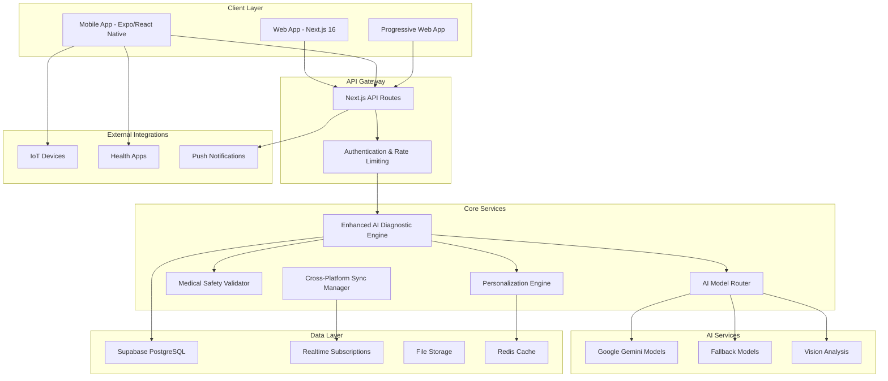

# Sihat TCM Developer Documentation

**Version**: 4.0 (Enhanced)  
**Last Updated**: December 2024  
**Target Audience**: Developers, System Architects, DevOps Engineers

## Table of Contents

1. [System Architecture](#system-architecture)
2. [Development Environment Setup](#development-environment-setup)
3. [Core Components](#core-components)
4. [API Integration Guide](#api-integration-guide)
5. [Database Schema](#database-schema)
6. [Testing Framework](#testing-framework)
7. [Deployment Guide](#deployment-guide)
8. [Performance Optimization](#performance-optimization)
9. [Security Guidelines](#security-guidelines)
10. [Monitoring and Logging](#monitoring-and-logging)
11. [Contributing Guidelines](#contributing-guidelines)
12. [Troubleshooting](#troubleshooting)

## System Architecture

### High-Level Architecture



### Technology Stack

#### Frontend

- **Web**: Next.js 16 with App Router, React 19.2.1, TypeScript
- **Mobile**: Expo SDK 52, React Native, TypeScript
- **Styling**: Tailwind CSS v4, Radix UI, Framer Motion
- **State Management**: React Context API, Zustand for complex state

#### Backend

- **Runtime**: Node.js with Next.js API Routes
- **Database**: Supabase (PostgreSQL) with Row Level Security
- **Authentication**: Supabase Auth with JWT tokens
- **File Storage**: Supabase Storage with CDN
- **Real-time**: Supabase Realtime subscriptions

#### AI & ML

- **Primary Models**: Google Gemini (2.0-flash, 2.5-pro, 3-pro-preview)
- **SDK**: Vercel AI SDK for model integration
- **Fallback**: Multiple model support with automatic routing
- **Vision**: Gemini Vision for image analysis

#### Development Tools

- **Language**: TypeScript 5.x
- **Testing**: Vitest, React Testing Library, Jest-DOM
- **Linting**: ESLint with Next.js config
- **Formatting**: Prettier
- **Build**: Next.js build system with Turbopack

## Development Environment Setup

### Prerequisites

```bash
# Required software
Node.js >= 18.17.0
npm >= 9.0.0 or yarn >= 1.22.0
Git >= 2.30.0

# For mobile development
Expo CLI >= 6.0.0
Android Studio (for Android development)
Xcode (for iOS development, macOS only)
```

### Initial Setup

1. **Clone the repository**

```bash
git clone https://github.com/your-org/sihat-tcm.git
cd sihat-tcm
```

2. **Install dependencies**

```bash
# Web application
npm install

# Mobile application
cd sihat-tcm-mobile
npm install
cd ..
```

3. **Environment configuration**

```bash
# Copy environment templates
cp .env.production.example .env.local
cp sihat-tcm-mobile/.env.example sihat-tcm-mobile/.env.local

# Configure required environment variables
# See Environment Variables section below
```

4. **Database setup**

```bash
# Install Supabase CLI
npm install -g @supabase/cli

# Initialize Supabase (if not already done)
supabase init

# Start local Supabase instance
supabase start

# Run migrations
supabase db reset
```

5. **Start development servers**

```bash
# Web application (port 3100)
npm run dev

# Mobile application (separate terminal)
cd sihat-tcm-mobile
npm start
```

### Environment Variables

#### Required Variables (.env.local)

```bash
# Supabase Configuration
NEXT_PUBLIC_SUPABASE_URL=your_supabase_url
NEXT_PUBLIC_SUPABASE_ANON_KEY=your_supabase_anon_key
SUPABASE_SERVICE_ROLE_KEY=your_service_role_key

# Google AI Configuration
GOOGLE_GENERATIVE_AI_API_KEY=your_gemini_api_key

# Application Configuration
NEXT_PUBLIC_APP_URL=http://localhost:3100
NEXT_PUBLIC_ENVIRONMENT=development

# Optional: External Integrations
NEXT_PUBLIC_SENTRY_DSN=your_sentry_dsn
NEXT_PUBLIC_ANALYTICS_ID=your_analytics_id
```

#### Mobile Environment Variables

```bash
# Expo Configuration
EXPO_PUBLIC_SUPABASE_URL=your_supabase_url
EXPO_PUBLIC_SUPABASE_ANON_KEY=your_supabase_anon_key
EXPO_PUBLIC_API_URL=http://localhost:3100/api

# Google AI Configuration
EXPO_PUBLIC_GOOGLE_AI_API_KEY=your_gemini_api_key
```

## Core Components

### Enhanced AI Diagnostic Engine

The central orchestrator for AI-powered TCM diagnosis.

```typescript
// Location: src/lib/enhancedAIDiagnosticEngine.ts

import { EnhancedAIDiagnosticEngine } from "@/lib/enhancedAIDiagnosticEngine";

// Initialize engine
const engine = new EnhancedAIDiagnosticEngine("MyApp");

// Process diagnosis
const result = await engine.processEnhancedDiagnosis({
  userId: "user123",
  doctorLevel: "expert",
  messages: chatHistory,
  images: medicalImages,
  requiresPersonalization: true,
  requiresSafetyValidation: true,
});
```

**Key Features:**

- Intelligent AI model routing
- Personalized recommendations
- Medical safety validation
- Performance monitoring
- Learning from feedback

### AI Model Router

Intelligent model selection and fallback handling.

```typescript
// Location: src/lib/aiModelRouter.ts

import { AIModelRouter } from '@/lib/aiModelRouter';

// Initialize router
const router = new AIModelRouter('MyApp');

// Analyze complexity
const complexity = router.analyzeComplexity({
  messages: chatHistory,
  images: medicalImages,
  requiresAnalysis: true
});

// Route request
const result = await router.generateWithRouting(
  { complexity, doctorLevel: 'expert' },
  { messages: [...] }
);
```

**Complexity Levels:**

- **Simple (0-24)**: Basic text processing
- **Moderate (25-49)**: Some complexity factors
- **Complex (50-74)**: Multiple factors
- **Advanced (75-100)**: Highly complex requests

### Medical Safety Validator

Comprehensive safety validation for all recommendations.

```typescript
// Location: src/lib/medicalSafetyValidator.ts

import { MedicalSafetyValidator } from "@/lib/medicalSafetyValidator";

// Initialize validator
const validator = new MedicalSafetyValidator("MyApp");

// Validate recommendations
const safetyResult = await validator.validateRecommendations(
  {
    dietary: ["ginger tea", "goji berries"],
    herbal: ["Four Gentlemen Decoction"],
  },
  {
    medical_history: {
      current_medications: ["warfarin"],
      allergies: ["shellfish"],
      pregnancy_status: "none",
    },
  }
);
```

**Safety Checks:**

- Allergy cross-referencing
- Drug-herb interactions
- Contraindications
- Emergency conditions
- Pregnancy safety
- Age appropriateness

### Personalization Engine

AI-powered personalized recommendations.

```typescript
// Location: src/lib/personalizationEngine.ts

import { PersonalizationEngine } from "@/lib/personalizationEngine";

// Initialize engine
const personalizer = new PersonalizationEngine("MyApp");

// Get personalization factors
const factors = await personalizer.getPersonalizationFactors("user123");

// Personalize recommendations
const personalizedDietary = await personalizer.personalizeDietaryRecommendations(
  ["ginger", "green tea", "warm foods"],
  factors
);
```

**Personalization Factors:**

- Cultural background
- Dietary preferences
- Lifestyle constraints
- Health goals
- Treatment history
- Constitution patterns

## API Integration Guide

### Authentication

All API requests require authentication using Supabase JWT tokens:

```typescript
// Client-side authentication
import { createClient } from "@supabase/supabase-js";

const supabase = createClient(
  process.env.NEXT_PUBLIC_SUPABASE_URL!,
  process.env.NEXT_PUBLIC_SUPABASE_ANON_KEY!
);

// Get session token
const {
  data: { session },
} = await supabase.auth.getSession();
const token = session?.access_token;

// Make authenticated request
const response = await fetch("/api/v2/enhanced-diagnosis", {
  method: "POST",
  headers: {
    Authorization: `Bearer ${token}`,
    "Content-Type": "application/json",
  },
  body: JSON.stringify(requestData),
});
```

### Error Handling

All APIs return consistent error responses:

```typescript
interface APIResponse<T> {
  success: boolean;
  data?: T;
  error?: {
    code: string;
    message: string;
    details?: any;
  };
}

// Error handling example
try {
  const response = await fetch("/api/v2/enhanced-diagnosis", options);
  const result: APIResponse<DiagnosisResult> = await response.json();

  if (!result.success) {
    throw new Error(result.error?.message || "API request failed");
  }

  return result.data;
} catch (error) {
  console.error("API Error:", error);
  // Handle error appropriately
}
```

### Rate Limiting

API endpoints have rate limits to ensure fair usage:

```typescript
// Rate limit headers in response
{
  'X-RateLimit-Limit': '100',
  'X-RateLimit-Remaining': '95',
  'X-RateLimit-Reset': '1640995200'
}

// Handle rate limiting
if (response.status === 429) {
  const resetTime = response.headers.get('X-RateLimit-Reset');
  const waitTime = parseInt(resetTime!) * 1000 - Date.now();

  // Wait and retry
  await new Promise(resolve => setTimeout(resolve, waitTime));
  return retryRequest();
}
```

## Database Schema

### Core Tables

#### Users and Profiles

```sql
-- Users table (extends auth.users)
CREATE TABLE public.users (
  id UUID REFERENCES auth.users PRIMARY KEY,
  email TEXT NOT NULL,
  role TEXT NOT NULL DEFAULT 'patient',
  preferences JSONB DEFAULT '{}',
  created_at TIMESTAMP WITH TIME ZONE DEFAULT NOW(),
  updated_at TIMESTAMP WITH TIME ZONE DEFAULT NOW()
);

-- Patient profiles
CREATE TABLE public.patients (
  id UUID REFERENCES public.users PRIMARY KEY,
  name TEXT NOT NULL,
  date_of_birth DATE,
  gender TEXT CHECK (gender IN ('male', 'female', 'other')),
  height INTEGER, -- cm
  weight DECIMAL(5,2), -- kg
  medical_history TEXT,
  allergies TEXT[],
  current_medications TEXT[],
  constitution TEXT,
  created_at TIMESTAMP WITH TIME ZONE DEFAULT NOW(),
  updated_at TIMESTAMP WITH TIME ZONE DEFAULT NOW()
);
```

#### Diagnosis and Reports

```sql
-- Diagnosis sessions
CREATE TABLE public.diagnosis_sessions (
  id UUID PRIMARY KEY DEFAULT gen_random_uuid(),
  patient_id UUID REFERENCES public.patients,
  practitioner_id UUID REFERENCES public.practitioners,
  status TEXT NOT NULL DEFAULT 'in_progress',
  data JSONB NOT NULL DEFAULT '{}',
  overall_score DECIMAL(5,2),
  confidence DECIMAL(3,2),
  created_at TIMESTAMP WITH TIME ZONE DEFAULT NOW(),
  updated_at TIMESTAMP WITH TIME ZONE DEFAULT NOW(),
  completed_at TIMESTAMP WITH TIME ZONE,
  expires_at TIMESTAMP WITH TIME ZONE DEFAULT (NOW() + INTERVAL '7 days')
);

-- Medical reports
CREATE TABLE public.medical_reports (
  id UUID PRIMARY KEY DEFAULT gen_random_uuid(),
  diagnosis_id UUID REFERENCES public.diagnosis_sessions,
  patient_id UUID REFERENCES public.patients,
  content JSONB NOT NULL,
  pdf_url TEXT,
  status TEXT DEFAULT 'draft',
  version INTEGER DEFAULT 1,
  created_at TIMESTAMP WITH TIME ZONE DEFAULT NOW(),
  updated_at TIMESTAMP WITH TIME ZONE DEFAULT NOW()
);
```

#### Health Tracking

```sql
-- Health time series data
CREATE TABLE public.health_time_series (
  id UUID PRIMARY KEY DEFAULT gen_random_uuid(),
  patient_id UUID REFERENCES public.patients,
  data_type TEXT NOT NULL,
  timestamp TIMESTAMP WITH TIME ZONE NOT NULL,
  value JSONB NOT NULL,
  source TEXT NOT NULL DEFAULT 'manual',
  confidence DECIMAL(3,2) DEFAULT 1.0,
  device_id TEXT,
  metadata JSONB DEFAULT '{}',
  created_at TIMESTAMP WITH TIME ZONE DEFAULT NOW()
);

-- IoT device registrations
CREATE TABLE public.iot_devices (
  id UUID PRIMARY KEY DEFAULT gen_random_uuid(),
  user_id UUID REFERENCES public.users,
  device_id TEXT NOT NULL,
  device_type TEXT NOT NULL,
  manufacturer TEXT,
  model TEXT,
  capabilities TEXT[],
  status TEXT DEFAULT 'registered',
  last_sync TIMESTAMP WITH TIME ZONE,
  created_at TIMESTAMP WITH TIME ZONE DEFAULT NOW()
);
```

### Indexes and Performance

```sql
-- Performance indexes
CREATE INDEX idx_diagnosis_sessions_patient_id ON public.diagnosis_sessions(patient_id);
CREATE INDEX idx_diagnosis_sessions_status ON public.diagnosis_sessions(status);
CREATE INDEX idx_health_time_series_patient_data ON public.health_time_series(patient_id, data_type, timestamp DESC);
CREATE INDEX idx_iot_devices_user_status ON public.iot_devices(user_id, status);

-- Full-text search indexes
CREATE INDEX idx_patients_name_fts ON public.patients USING gin(to_tsvector('english', name));
CREATE INDEX idx_medical_reports_content_fts ON public.medical_reports USING gin(to_tsvector('english', content::text));
```

### Row Level Security (RLS)

```sql
-- Enable RLS on all tables
ALTER TABLE public.patients ENABLE ROW LEVEL SECURITY;
ALTER TABLE public.diagnosis_sessions ENABLE ROW LEVEL SECURITY;
ALTER TABLE public.medical_reports ENABLE ROW LEVEL SECURITY;

-- Patient data access policy
CREATE POLICY "Users can access their own patient data" ON public.patients
  FOR ALL USING (auth.uid() = id);

-- Diagnosis session access policy
CREATE POLICY "Users can access their own diagnosis sessions" ON public.diagnosis_sessions
  FOR ALL USING (
    patient_id IN (
      SELECT id FROM public.patients WHERE id = auth.uid()
    )
  );
```

## Testing Framework

### Unit Testing with Vitest

```typescript
// Example test file: src/lib/__tests__/aiModelRouter.test.ts

import { describe, it, expect, beforeEach } from "vitest";
import { AIModelRouter } from "../aiModelRouter";

describe("AIModelRouter", () => {
  let router: AIModelRouter;

  beforeEach(() => {
    router = new AIModelRouter("test");
  });

  it("should analyze request complexity correctly", () => {
    const complexity = router.analyzeComplexity({
      messages: new Array(15).fill({ role: "user", content: "test" }),
      images: [{ type: "tongue", data: "base64..." }],
      requiresAnalysis: true,
    });

    expect(complexity.type).toBe("complex");
    expect(complexity.score).toBeGreaterThan(50);
    expect(complexity.factors.hasImages).toBe(true);
    expect(complexity.factors.hasLongHistory).toBe(true);
  });

  it("should select appropriate model for complex requests", () => {
    const complexity = { type: "complex" as const, score: 65, factors: {} };
    const selection = router.selectModel({
      complexity,
      doctorLevel: "expert",
      requiresVision: true,
    });

    expect(selection.primaryModel).toContain("gemini");
    expect(selection.fallbackModels).toHaveLength.greaterThan(0);
  });
});
```

### Property-Based Testing

```typescript
// Example property test: src/lib/__tests__/correctnessProperties.test.ts

import { describe, it } from "vitest";
import fc from "fast-check";
import { MedicalSafetyValidator } from "../medicalSafetyValidator";

describe("Medical Safety Validator Properties", () => {
  const validator = new MedicalSafetyValidator("test");

  it("Property 1: Safety validation should always return a result", async () => {
    await fc.assert(
      fc.asyncProperty(
        fc.array(fc.string(), { minLength: 1, maxLength: 10 }), // recommendations
        fc.array(fc.string(), { minLength: 0, maxLength: 5 }), // medications
        fc.array(fc.string(), { minLength: 0, maxLength: 3 }), // allergies
        async (recommendations, medications, allergies) => {
          const result = await validator.validateRecommendations(
            { dietary: recommendations },
            {
              medical_history: {
                current_medications: medications,
                allergies: allergies,
                medical_conditions: [],
              },
            }
          );

          // Property: Result should always have required fields
          expect(result).toHaveProperty("is_safe");
          expect(result).toHaveProperty("risk_level");
          expect(result).toHaveProperty("concerns");
          expect(["low", "medium", "high", "critical"]).toContain(result.risk_level);
        }
      ),
      { numRuns: 100 }
    );
  });
});
```

### Integration Testing

```typescript
// Example integration test: src/app/api/__tests__/enhanced-diagnosis.test.ts

import { describe, it, expect } from "vitest";
import { POST } from "../v2/enhanced-diagnosis/route";
import { createMockRequest } from "@/test-utils";

describe("/api/v2/enhanced-diagnosis", () => {
  it("should process enhanced diagnosis request", async () => {
    const request = createMockRequest({
      method: "POST",
      body: {
        userId: "test-user",
        doctorLevel: "expert",
        messages: [{ role: "user", content: "I have been feeling tired lately" }],
        basicInfo: {
          age: 35,
          gender: "male",
          height: 175,
          weight: 70,
        },
        requiresPersonalization: true,
        requiresSafetyValidation: true,
      },
    });

    const response = await POST(request);
    const result = await response.json();

    expect(response.status).toBe(200);
    expect(result.success).toBe(true);
    expect(result.data).toHaveProperty("diagnosis");
    expect(result.data).toHaveProperty("modelUsed");
    expect(result.data).toHaveProperty("confidenceScore");
  });
});
```

### Running Tests

```bash
# Run all tests
npm test

# Run tests in watch mode
npm run test:watch

# Run tests with coverage
npm run test:coverage

# Run property-based tests specifically
npm run test:properties

# Run integration tests
npm run test:integration
```

## Deployment Guide

### Production Environment Setup

#### Vercel Deployment (Recommended)

1. **Connect repository to Vercel**

```bash
# Install Vercel CLI
npm install -g vercel

# Login and link project
vercel login
vercel link
```

2. **Configure environment variables**

```bash
# Set production environment variables
vercel env add NEXT_PUBLIC_SUPABASE_URL production
vercel env add NEXT_PUBLIC_SUPABASE_ANON_KEY production
vercel env add SUPABASE_SERVICE_ROLE_KEY production
vercel env add GOOGLE_GENERATIVE_AI_API_KEY production
```

3. **Deploy**

```bash
# Deploy to production
vercel --prod
```

#### Docker Deployment

```dockerfile
# Dockerfile
FROM node:18-alpine AS base

# Install dependencies only when needed
FROM base AS deps
RUN apk add --no-cache libc6-compat
WORKDIR /app

COPY package.json package-lock.json ./
RUN npm ci --only=production

# Rebuild the source code only when needed
FROM base AS builder
WORKDIR /app
COPY --from=deps /app/node_modules ./node_modules
COPY . .

ENV NEXT_TELEMETRY_DISABLED 1
RUN npm run build

# Production image
FROM base AS runner
WORKDIR /app

ENV NODE_ENV production
ENV NEXT_TELEMETRY_DISABLED 1

RUN addgroup --system --gid 1001 nodejs
RUN adduser --system --uid 1001 nextjs

COPY --from=builder /app/public ./public
COPY --from=builder --chown=nextjs:nodejs /app/.next/standalone ./
COPY --from=builder --chown=nextjs:nodejs /app/.next/static ./.next/static

USER nextjs

EXPOSE 3000
ENV PORT 3000

CMD ["node", "server.js"]
```

```bash
# Build and run Docker container
docker build -t sihat-tcm .
docker run -p 3000:3000 sihat-tcm
```

### Mobile App Deployment

#### iOS Deployment

```bash
# Build for iOS
cd sihat-tcm-mobile
eas build --platform ios --profile production

# Submit to App Store
eas submit --platform ios
```

#### Android Deployment

```bash
# Build for Android
eas build --platform android --profile production

# Submit to Google Play
eas submit --platform android
```

### Database Migration

```bash
# Run production migrations
supabase db push --db-url "postgresql://..."

# Verify migration status
supabase migration list --db-url "postgresql://..."
```

## Performance Optimization

### Frontend Optimization

#### Code Splitting and Lazy Loading

```typescript
// Lazy load heavy components
import { lazy, Suspense } from 'react';

const DiagnosisWizard = lazy(() => import('@/components/diagnosis/DiagnosisWizard'));
const MealPlanner = lazy(() => import('@/components/meal-planner/MealPlanner'));

function App() {
  return (
    <Suspense fallback={<LoadingSpinner />}>
      <DiagnosisWizard />
    </Suspense>
  );
}
```

#### Image Optimization

```typescript
// Use Next.js Image component for automatic optimization
import Image from 'next/image';

function TongueAnalysis({ imageUrl }: { imageUrl: string }) {
  return (
    <Image
      src={imageUrl}
      alt="Tongue analysis"
      width={400}
      height={300}
      priority={true}
      placeholder="blur"
      blurDataURL="data:image/jpeg;base64,..."
    />
  );
}
```

#### Bundle Analysis

```bash
# Analyze bundle size
npm run analyze

# Check for duplicate dependencies
npx duplicate-package-checker

# Optimize bundle
npm run build -- --analyze
```

### Backend Optimization

#### Database Query Optimization

```sql
-- Use appropriate indexes
CREATE INDEX CONCURRENTLY idx_diagnosis_sessions_patient_created
ON diagnosis_sessions(patient_id, created_at DESC);

-- Optimize complex queries
EXPLAIN ANALYZE SELECT
  ds.id,
  ds.data,
  p.name,
  p.constitution
FROM diagnosis_sessions ds
JOIN patients p ON ds.patient_id = p.id
WHERE ds.patient_id = $1
  AND ds.created_at > NOW() - INTERVAL '30 days'
ORDER BY ds.created_at DESC
LIMIT 10;
```

#### Caching Strategy

```typescript
// Redis caching for expensive operations
import Redis from "ioredis";

const redis = new Redis(process.env.REDIS_URL);

async function getCachedDiagnosis(key: string) {
  const cached = await redis.get(key);
  if (cached) {
    return JSON.parse(cached);
  }

  const result = await generateDiagnosis();
  await redis.setex(key, 3600, JSON.stringify(result)); // Cache for 1 hour
  return result;
}
```

#### API Response Optimization

```typescript
// Compress responses
import compression from "compression";

// Use in API routes
export async function GET(request: Request) {
  const data = await fetchLargeDataset();

  // Compress large responses
  const compressed = await compress(JSON.stringify(data));

  return new Response(compressed, {
    headers: {
      "Content-Type": "application/json",
      "Content-Encoding": "gzip",
    },
  });
}
```

### AI Model Optimization

#### Model Selection Optimization

```typescript
// Optimize model selection based on performance metrics
class OptimizedModelRouter extends AIModelRouter {
  selectOptimalModel(criteria: ModelSelectionCriteria): string {
    const performanceData = this.getModelPerformance();

    // Select based on response time and success rate
    const candidates = this.getCandidateModels(criteria);
    return candidates.reduce((best, current) => {
      const currentPerf = performanceData[current];
      const bestPerf = performanceData[best];

      if (
        !bestPerf ||
        (currentPerf.successRate > bestPerf.successRate &&
          currentPerf.averageResponseTime < bestPerf.averageResponseTime)
      ) {
        return current;
      }
      return best;
    });
  }
}
```

## Security Guidelines

### Authentication and Authorization

#### JWT Token Validation

```typescript
// Validate JWT tokens in API routes
import { createServerClient } from "@supabase/ssr";

export async function validateAuth(request: Request) {
  const token = request.headers.get("Authorization")?.replace("Bearer ", "");

  if (!token) {
    throw new Error("No authentication token provided");
  }

  const supabase = createServerClient(
    process.env.NEXT_PUBLIC_SUPABASE_URL!,
    process.env.SUPABASE_SERVICE_ROLE_KEY!,
    {
      cookies: {
        get: () => undefined,
        set: () => {},
        remove: () => {},
      },
    }
  );

  const {
    data: { user },
    error,
  } = await supabase.auth.getUser(token);

  if (error || !user) {
    throw new Error("Invalid authentication token");
  }

  return user;
}
```

#### Role-Based Access Control

```typescript
// Check user roles and permissions
export async function checkPermissions(userId: string, requiredRole: string) {
  const { data: user } = await supabase.from("users").select("role").eq("id", userId).single();

  if (!user || user.role !== requiredRole) {
    throw new Error("Insufficient permissions");
  }
}
```

### Data Protection

#### Input Validation and Sanitization

```typescript
// Validate and sanitize user inputs
import { z } from "zod";
import DOMPurify from "dompurify";

const DiagnosisRequestSchema = z.object({
  userId: z.string().uuid(),
  messages: z.array(
    z.object({
      role: z.enum(["user", "assistant"]),
      content: z.string().max(10000),
    })
  ),
  basicInfo: z.object({
    age: z.number().min(0).max(150),
    gender: z.enum(["male", "female", "other"]),
    height: z.number().min(50).max(300),
    weight: z.number().min(10).max(500),
  }),
});

export function validateDiagnosisRequest(data: unknown) {
  const validated = DiagnosisRequestSchema.parse(data);

  // Sanitize text content
  validated.messages = validated.messages.map((msg) => ({
    ...msg,
    content: DOMPurify.sanitize(msg.content),
  }));

  return validated;
}
```

#### SQL Injection Prevention

```typescript
// Use parameterized queries
export async function getUserDiagnoses(userId: string, limit: number = 10) {
  const { data, error } = await supabase
    .from("diagnosis_sessions")
    .select(
      `
      id,
      created_at,
      status,
      overall_score,
      medical_reports (
        id,
        content
      )
    `
    )
    .eq("patient_id", userId)
    .order("created_at", { ascending: false })
    .limit(limit);

  if (error) {
    throw new Error("Database query failed");
  }

  return data;
}
```

### API Security

#### Rate Limiting

```typescript
// Implement rate limiting
import { Ratelimit } from "@upstash/ratelimit";
import { Redis } from "@upstash/redis";

const ratelimit = new Ratelimit({
  redis: Redis.fromEnv(),
  limiter: Ratelimit.slidingWindow(100, "1 h"), // 100 requests per hour
});

export async function checkRateLimit(identifier: string) {
  const { success, limit, reset, remaining } = await ratelimit.limit(identifier);

  if (!success) {
    throw new Error("Rate limit exceeded");
  }

  return { limit, reset, remaining };
}
```

#### CORS Configuration

```typescript
// Configure CORS properly
export async function handleCORS(request: Request) {
  const origin = request.headers.get("origin");
  const allowedOrigins = [
    "https://sihat-tcm.com",
    "https://app.sihat-tcm.com",
    process.env.NODE_ENV === "development" ? "http://localhost:3100" : null,
  ].filter(Boolean);

  if (origin && allowedOrigins.includes(origin)) {
    return {
      "Access-Control-Allow-Origin": origin,
      "Access-Control-Allow-Methods": "GET, POST, PUT, DELETE, OPTIONS",
      "Access-Control-Allow-Headers": "Content-Type, Authorization",
      "Access-Control-Max-Age": "86400",
    };
  }

  return {};
}
```

## Monitoring and Logging

### Application Monitoring

#### Performance Monitoring with Sentry

```typescript
// Configure Sentry for error tracking
import * as Sentry from "@sentry/nextjs";

Sentry.init({
  dsn: process.env.NEXT_PUBLIC_SENTRY_DSN,
  environment: process.env.NODE_ENV,
  tracesSampleRate: 0.1,
  beforeSend(event) {
    // Filter out sensitive information
    if (event.request?.data) {
      delete event.request.data.medicalHistory;
      delete event.request.data.personalInfo;
    }
    return event;
  },
});

// Custom performance monitoring
export function trackPerformance(operation: string, duration: number) {
  Sentry.addBreadcrumb({
    message: `${operation} completed`,
    level: "info",
    data: { duration },
  });
}
```

#### Health Checks

```typescript
// Health check endpoint
export async function GET() {
  const checks = await Promise.allSettled([
    checkDatabase(),
    checkAIServices(),
    checkExternalAPIs(),
  ]);

  const results = checks.map((check, index) => ({
    service: ["database", "ai_services", "external_apis"][index],
    status: check.status === "fulfilled" ? "healthy" : "unhealthy",
    details: check.status === "fulfilled" ? check.value : check.reason,
  }));

  const overallStatus = results.every((r) => r.status === "healthy") ? "healthy" : "degraded";

  return Response.json({
    status: overallStatus,
    timestamp: new Date().toISOString(),
    checks: results,
  });
}
```

### Logging Strategy

#### Structured Logging

```typescript
// Structured logging utility
import winston from "winston";

const logger = winston.createLogger({
  level: process.env.LOG_LEVEL || "info",
  format: winston.format.combine(
    winston.format.timestamp(),
    winston.format.errors({ stack: true }),
    winston.format.json()
  ),
  transports: [
    new winston.transports.Console(),
    new winston.transports.File({ filename: "logs/error.log", level: "error" }),
    new winston.transports.File({ filename: "logs/combined.log" }),
  ],
});

export function logDiagnosisRequest(userId: string, requestData: any) {
  logger.info("Diagnosis request initiated", {
    userId,
    requestType: requestData.type,
    complexity: requestData.complexity,
    timestamp: new Date().toISOString(),
  });
}

export function logAIModelUsage(modelId: string, responseTime: number, success: boolean) {
  logger.info("AI model usage", {
    modelId,
    responseTime,
    success,
    timestamp: new Date().toISOString(),
  });
}
```

### Analytics and Metrics

#### Custom Analytics

```typescript
// Track user interactions and system performance
export class AnalyticsTracker {
  static trackDiagnosisCompletion(userId: string, duration: number, satisfaction: number) {
    // Send to analytics service
    this.sendEvent("diagnosis_completed", {
      userId,
      duration,
      satisfaction,
      timestamp: Date.now(),
    });
  }

  static trackAIModelPerformance(modelId: string, metrics: ModelPerformanceMetrics) {
    this.sendEvent("ai_model_performance", {
      modelId,
      ...metrics,
      timestamp: Date.now(),
    });
  }

  private static sendEvent(eventName: string, data: any) {
    // Implementation depends on analytics provider
    // Could be Google Analytics, Mixpanel, custom solution, etc.
  }
}
```

## Contributing Guidelines

### Code Style and Standards

#### TypeScript Guidelines

```typescript
// Use strict TypeScript configuration
// tsconfig.json
{
  "compilerOptions": {
    "strict": true,
    "noImplicitAny": true,
    "noImplicitReturns": true,
    "noUnusedLocals": true,
    "noUnusedParameters": true
  }
}

// Prefer interfaces over types for object shapes
interface UserProfile {
  id: string;
  name: string;
  email: string;
}

// Use enums for constants
enum DiagnosisStatus {
  IN_PROGRESS = 'in_progress',
  COMPLETED = 'completed',
  CANCELLED = 'cancelled'
}

// Document complex functions
/**
 * Processes enhanced TCM diagnosis with AI model routing and safety validation
 * @param request - The diagnosis request containing user data and preferences
 * @returns Promise resolving to comprehensive diagnosis result
 * @throws {ValidationError} When request data is invalid
 * @throws {AIServiceError} When AI processing fails
 */
async function processEnhancedDiagnosis(request: DiagnosisRequest): Promise<DiagnosisResult> {
  // Implementation
}
```

#### React Component Guidelines

```typescript
// Use functional components with TypeScript
interface DiagnosisWizardProps {
  userId: string;
  onComplete: (result: DiagnosisResult) => void;
  onError: (error: Error) => void;
}

export function DiagnosisWizard({ userId, onComplete, onError }: DiagnosisWizardProps) {
  // Use hooks for state management
  const [currentStep, setCurrentStep] = useState(0);
  const [diagnosisData, setDiagnosisData] = useState<DiagnosisData>({});

  // Memoize expensive calculations
  const complexCalculation = useMemo(() => {
    return performExpensiveCalculation(diagnosisData);
  }, [diagnosisData]);

  // Handle side effects properly
  useEffect(() => {
    // Cleanup function for subscriptions
    const subscription = subscribeToUpdates(userId);
    return () => subscription.unsubscribe();
  }, [userId]);

  return (
    <div className="diagnosis-wizard">
      {/* Component JSX */}
    </div>
  );
}
```

### Git Workflow

#### Branch Naming Convention

```bash
# Feature branches
feature/enhanced-ai-routing
feature/safety-validation
feature/mobile-sync

# Bug fix branches
bugfix/diagnosis-timeout
bugfix/image-upload-error

# Hotfix branches
hotfix/security-patch
hotfix/critical-ai-error
```

#### Commit Message Format

```bash
# Format: type(scope): description
feat(ai): add intelligent model routing with fallback
fix(safety): resolve drug interaction validation bug
docs(api): update enhanced diagnosis endpoint documentation
test(router): add property-based tests for model selection
refactor(engine): improve diagnostic pipeline performance
```

#### Pull Request Process

1. **Create feature branch from main**

```bash
git checkout main
git pull origin main
git checkout -b feature/your-feature-name
```

2. **Make changes and commit**

```bash
git add .
git commit -m "feat(scope): description of changes"
```

3. **Push and create PR**

```bash
git push origin feature/your-feature-name
# Create PR through GitHub interface
```

4. **PR Requirements**

- [ ] All tests pass
- [ ] Code coverage maintained
- [ ] Documentation updated
- [ ] Security review completed
- [ ] Performance impact assessed

### Code Review Guidelines

#### Review Checklist

**Functionality**

- [ ] Code works as intended
- [ ] Edge cases are handled
- [ ] Error handling is appropriate
- [ ] Performance is acceptable

**Security**

- [ ] Input validation is present
- [ ] No sensitive data exposure
- [ ] Authentication/authorization correct
- [ ] SQL injection prevention

**Code Quality**

- [ ] Code is readable and maintainable
- [ ] TypeScript types are correct
- [ ] No code duplication
- [ ] Follows project conventions

**Testing**

- [ ] Unit tests cover new functionality
- [ ] Integration tests pass
- [ ] Property-based tests for complex logic
- [ ] Manual testing completed

## Troubleshooting

### Common Development Issues

#### Environment Setup Issues

**Problem**: Supabase connection fails

```bash
# Check environment variables
echo $NEXT_PUBLIC_SUPABASE_URL
echo $NEXT_PUBLIC_SUPABASE_ANON_KEY

# Verify Supabase CLI installation
supabase --version

# Reset local Supabase instance
supabase stop
supabase start
```

**Problem**: AI API key issues

```bash
# Verify API key format
echo $GOOGLE_GENERATIVE_AI_API_KEY | wc -c  # Should be ~40 characters

# Test API key
curl -H "Authorization: Bearer $GOOGLE_GENERATIVE_AI_API_KEY" \
  https://generativelanguage.googleapis.com/v1/models
```

#### Build and Runtime Issues

**Problem**: Next.js build fails

```bash
# Clear Next.js cache
rm -rf .next
npm run build

# Check for TypeScript errors
npx tsc --noEmit

# Analyze bundle size
npm run analyze
```

**Problem**: Mobile app won't start

```bash
# Clear Expo cache
npx expo start --clear

# Reset Metro bundler
npx expo start --reset-cache

# Check for dependency issues
cd sihat-tcm-mobile
npm install
```

### Performance Issues

#### Slow API Responses

1. **Check AI model performance**

```typescript
// Monitor model response times
const router = new AIModelRouter();
const stats = router.getRouterStats();
console.log("Model performance:", stats.modelPerformance);
```

2. **Database query optimization**

```sql
-- Check slow queries
SELECT query, mean_time, calls
FROM pg_stat_statements
ORDER BY mean_time DESC
LIMIT 10;

-- Analyze specific query
EXPLAIN ANALYZE SELECT * FROM diagnosis_sessions WHERE patient_id = $1;
```

3. **Enable caching**

```typescript
// Add Redis caching for expensive operations
const cached = await redis.get(`diagnosis:${userId}`);
if (cached) return JSON.parse(cached);
```

#### Memory Issues

1. **Monitor memory usage**

```bash
# Check Node.js memory usage
node --inspect app.js
# Open chrome://inspect in Chrome

# Monitor with PM2
pm2 monit
```

2. **Optimize large data processing**

```typescript
// Stream large datasets instead of loading all at once
async function* processLargeDataset(data: any[]) {
  for (const item of data) {
    yield await processItem(item);
  }
}
```

### Production Issues

#### Deployment Problems

**Problem**: Vercel deployment fails

```bash
# Check build logs
vercel logs

# Verify environment variables
vercel env ls

# Test build locally
npm run build
npm start
```

**Problem**: Database migration issues

```bash
# Check migration status
supabase migration list --db-url $DATABASE_URL

# Run specific migration
supabase migration up --db-url $DATABASE_URL
```

#### Monitoring and Alerts

**Set up alerts for critical issues**

```typescript
// Configure Sentry alerts
Sentry.configureScope((scope) => {
  scope.setTag("component", "ai-diagnostic-engine");
  scope.setLevel("error");
});

// Custom health check alerts
if (healthCheck.status === "unhealthy") {
  await sendAlert({
    type: "system_health",
    severity: "critical",
    message: "System health check failed",
    details: healthCheck.results,
  });
}
```

### Getting Help

#### Internal Resources

- **Documentation**: `/docs` directory
- **API Reference**: `/docs/API_DOCUMENTATION.md`
- **Architecture**: `/docs/SYSTEM_ARCHITECTURE.md`

#### External Resources

- **Next.js Documentation**: https://nextjs.org/docs
- **Supabase Documentation**: https://supabase.com/docs
- **React Native Documentation**: https://reactnative.dev/docs
- **Vercel AI SDK**: https://sdk.vercel.ai/docs

#### Support Channels

- **GitHub Issues**: For bugs and feature requests
- **Team Slack**: For development discussions
- **Code Reviews**: For architectural decisions

---

**This documentation is maintained by the Sihat TCM development team. For updates or corrections, please submit a pull request.**
