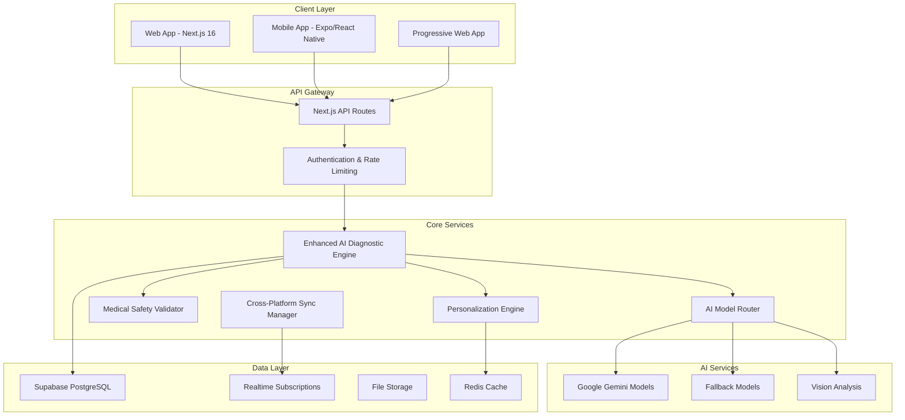

# Sihat TCM Developer Guide

**Version**: 5.0 (Consolidated)  
**Last Updated**: December 2024  
**Target Audience**: Developers, System Architects, DevOps Engineers

> **Note**: This guide consolidates content from `DEVELOPER_MANUAL.md` and `DEVELOPER_DOCUMENTATION.md`. For the original detailed files, see `archive/`.

## Table of Contents

1. [System Overview](#system-overview)
2. [Architecture](#architecture)
3. [Getting Started](#getting-started)
4. [Project Structure](#project-structure)
5. [Key Components](#key-components)
6. [API Integration Guide](#api-integration-guide)
7. [Database Schema](#database-schema)
8. [Authentication & Authorization](#authentication--authorization)
9. [Development Workflow](#development-workflow)
10. [Testing Framework](#testing-framework)
11. [Deployment Guide](#deployment-guide)
12. [Performance Optimization](#performance-optimization)
13. [Security Guidelines](#security-guidelines)
14. [Monitoring and Logging](#monitoring-and-logging)
15. [Contributing Guidelines](#contributing-guidelines)
16. [Troubleshooting](#troubleshooting)

---

## System Overview

Sihat TCM is a comprehensive Traditional Chinese Medicine (TCM) diagnostic and patient management system. The platform consists of:

- **Web Application**: Next.js-based web platform for practitioners and administrators
- **Mobile Application**: React Native/Expo mobile app for patients
- **Backend**: Next.js API routes with Supabase integration
- **AI Integration**: Gemini AI for diagnostic assistance and report generation

### Key Features

**Core Features:**
- Patient onboarding and medical history collection
- TCM diagnostic workflows (Four Examinations: pulse, tongue, face, body)
- AI-powered diagnostic assistance using Gemini AI
- Medical report generation and management
- Multi-language support (English, Malay, Chinese)
- Role-based access control (Guest, Patient, Doctor, Admin)
- Real-time chat with AI for medical inquiries

**Patient Portal Features:**
- Health Journey Dashboard: Unified patient portal with health trends and diagnostics
- AI Meal Planner: Personalized 7-day TCM meal plans with shopping lists
- TCM Food Checker: Evaluate food suitability based on diagnosis
- Qi Dose (Baduanjin): Guided TCM exercises with gamified "Qi Garden"
- Vitality Rhythm: Constitution tracker, seasonal alerts, and meridian clock
- Snore Analysis: AI-powered TCM-based sleep and fatigue assessment
- Circle of Health: Anonymous community support groups
- Family Health Management: Manage family member health profiles
- Western Doctor Chat: AI-powered second opinion consultation
- Digital Twin: Visual health organ mapping
- Herb Shop: TCM herb and product recommendations
- Infographics Generator: AI-generated personalized health infographics
- Health Data Import: Connect wearables and health devices (IoT integration)

---

## Architecture

### High-Level Architecture



### Technology Stack

#### Frontend
- **Web**: Next.js 16 with App Router, React 19.2.1, TypeScript
- **Mobile**: Expo SDK 52, React Native, TypeScript
- **Styling**: Tailwind CSS v4, Radix UI, Framer Motion
- **State Management**: React Context API, Zustand for complex state

#### Backend
- **Runtime**: Node.js with Next.js API Routes
- **Database**: Supabase (PostgreSQL) with Row Level Security
- **Authentication**: Supabase Auth with JWT tokens
- **File Storage**: Supabase Storage with CDN
- **Real-time**: Supabase Realtime subscriptions

#### AI & ML
- **Primary Models**: Google Gemini (2.0-flash, 2.5-pro, 3-pro-preview)
- **SDK**: Vercel AI SDK for model integration
- **Fallback**: Multiple model support with automatic routing
- **Vision**: Gemini Vision for image analysis

#### Development Tools
- **Language**: TypeScript 5.x
- **Testing**: Vitest, React Testing Library, Jest-DOM
- **Linting**: ESLint with Next.js config
- **Formatting**: Prettier
- **Build**: Next.js build system with Turbopack

---

## Getting Started

### Prerequisites

```bash
# Required software
Node.js >= 18.17.0
npm >= 9.0.0 or yarn >= 1.22.0
Git >= 2.30.0

# For mobile development
Expo CLI >= 6.0.0
Android Studio (for Android development)
Xcode (for iOS development, macOS only)
```

### Initial Setup

1. **Clone the repository**

   ```bash
   git clone <repository-url>
   cd "Sihat TCM/sihat-tcm-web"
   ```

2. **Install dependencies**

   ```bash
   npm install
   ```

3. **Environment Variables**

   Create a `.env.local` file in the `sihat-tcm-web` directory:

   ```env
   # Supabase Configuration
   NEXT_PUBLIC_SUPABASE_URL=your_supabase_url
   NEXT_PUBLIC_SUPABASE_ANON_KEY=your_supabase_anon_key
   SUPABASE_SERVICE_ROLE_KEY=your_service_role_key

   # Google AI Configuration
   GOOGLE_GENERATIVE_AI_API_KEY=your_gemini_api_key

   # Application Configuration
   NEXT_PUBLIC_APP_URL=http://localhost:3100
   NEXT_PUBLIC_ENVIRONMENT=development

   # Optional: External Integrations
   NEXT_PUBLIC_SENTRY_DSN=your_sentry_dsn
   NEXT_PUBLIC_ANALYTICS_ID=your_analytics_id
   ```

4. **Database Setup**

   The Supabase CLI can be used via `npx` without global installation:

   ```bash
   # Login to Supabase
   npx supabase login

   # Link to your remote project
   npx supabase link --project-ref <your-project-ref>

   # Pull the remote schema (optional, to sync with existing project)
   npx supabase db pull
   ```

   **Using Supabase CLI for Migrations**

   ```bash
   # Initialize Supabase in your project (creates supabase/ directory)
   npx supabase init

   # Start local Supabase (requires Docker)
   npx supabase start

   # Create a new migration
   npx supabase migration new <migration-name>

   # Apply migrations to local database
   npx supabase db reset

   # Push migrations to remote database
   npx supabase db push

   # Generate TypeScript types from your database
   npx supabase gen types typescript --local > src/types/supabase.ts
   ```

5. **Run the development server**

   ```bash
   npm run dev
   ```

   The application will be available at `http://localhost:3100`

6. **Blog Management (Tina CMS)**

   To manage blog content, use the specialized Tina dev command:

   ```bash
   npm run dev:tina
   ```

   The editor will be available at `http://localhost:3100/tina-admin/index.html`

7. **Troubleshooting Hot Reload Issues**

   If you experience hot reload problems, try these solutions:

   **Quick Fix - Clear Next.js Cache:**
   ```bash
   npm run dev:clear
   # Or manually:
   rm -rf .next && npm run dev
   ```

   **Full Reset - Clear node_modules:**
   ```bash
   rm -rf node_modules package-lock.json
   npm install
   npm run dev
   ```

   **Test with Turbopack (experimental):**
   ```bash
   npm run dev:turbo
   ```

   **Increase Node.js Memory (if you see "out of memory" errors):**
   - Windows (PowerShell): `$env:NODE_OPTIONS="--max-old-space-size=8192"; npm run dev`
   - Windows (CMD): `set NODE_OPTIONS=--max-old-space-size=8192 && npm run dev`
   - Linux/Mac: `NODE_OPTIONS="--max-old-space-size=8192" npm run dev`

### Mobile App Setup

1. **Navigate to mobile directory**
   ```bash
   cd ../sihat-tcm-mobile
   ```

2. **Install dependencies**
   ```bash
   npm install
   ```

3. **Configure API endpoint**

   Update `lib/apiConfig.js` with your web application URL:
   ```javascript
   export const API_BASE_URL = "http://localhost:3100";
   ```

4. **Run the mobile app**
   ```bash
   npx expo start
   ```

---

## Project Structure

### Web Application Structure

```
sihat-tcm-web/
├── src/
│   ├── app/                    # Next.js App Router pages
│   │   ├── actions/            # Server Actions
│   │   ├── api/                # API routes
│   │   ├── admin/              # Admin dashboard
│   │   ├── doctor/             # Doctor dashboard
│   │   ├── patient/            # Patient portal
│   │   ├── blog/               # Blog pages (Tina CMS)
│   │   └── login/              # Authentication pages
│   ├── components/             # React components
│   │   ├── admin/              # Admin-specific components
│   │   ├── diagnosis/          # Diagnosis workflow components
│   │   ├── meal-planner/       # AI Meal Planner components
│   │   ├── patient/            # Patient portal components
│   │   ├── qi-dose/            # Baduanjin exercise components
│   │   └── ui/                 # Reusable UI components (shadcn/ui)
│   ├── contexts/               # React Context providers
│   ├── hooks/                  # Custom React hooks
│   ├── lib/                    # Utility libraries
│   └── middleware.ts           # Next.js middleware (auth, routing)
├── public/                     # Static assets
├── tina/                       # Tina CMS configuration
├── scripts/                    # Utility scripts
└── package.json
```

### Mobile Application Structure

```
sihat-tcm-mobile/
├── screens/                    # Screen components
├── components/                 # Reusable components
├── contexts/                   # React Context providers
├── lib/                        # Utilities
└── constants/                  # Constants and configs
```

---

## Key Components

### Authentication System

**Location**: `src/contexts/AuthContext.tsx`, `src/app/api/auth/`

The authentication system uses Supabase Auth with role-based access control:
- **Roles**: Patient, Doctor, Admin
- **Middleware**: `src/middleware.ts` handles route protection
- **Context**: `AuthContext` provides authentication state throughout the app

### Enhanced AI Diagnostic Engine

The central orchestrator for AI-powered TCM diagnosis.

```typescript
import { EnhancedAIDiagnosticEngine } from "@/lib/enhancedAIDiagnosticEngine";

const engine = new EnhancedAIDiagnosticEngine("MyApp");

const result = await engine.processEnhancedDiagnosis({
  userId: "user123",
  doctorLevel: "expert",
  messages: chatHistory,
  images: medicalImages,
  requiresPersonalization: true,
  requiresSafetyValidation: true,
});
```

**Key Features:**
- Intelligent AI model routing
- Personalized recommendations
- Medical safety validation
- Performance monitoring
- Learning from feedback

### AI Model Router

Intelligent model selection and fallback handling.

```typescript
import { AIModelRouter } from '@/lib/aiModelRouter';

const router = new AIModelRouter('MyApp');
const complexity = router.analyzeComplexity({
  messages: chatHistory,
  images: medicalImages,
  requiresAnalysis: true
});

const result = await router.generateWithRouting(
  { complexity, doctorLevel: 'expert' },
  { messages: [...] }
);
```

**Complexity Levels:**
- **Simple (0-24)**: Basic text processing
- **Moderate (25-49)**: Some complexity factors
- **Complex (50-74)**: Multiple factors
- **Advanced (75-100)**: Highly complex requests

### Medical Safety Validator

Comprehensive safety validation for all recommendations.

```typescript
import { MedicalSafetyValidator } from "@/lib/medicalSafetyValidator";

const validator = new MedicalSafetyValidator("MyApp");

const safetyResult = await validator.validateRecommendations(
  {
    dietary: ["ginger tea", "goji berries"],
    herbal: ["Four Gentlemen Decoction"],
  },
  {
    medical_history: {
      current_medications: ["warfarin"],
      allergies: ["shellfish"],
      pregnancy_status: "none",
    },
  }
);
```

**Safety Checks:**
- Allergy cross-referencing
- Drug-herb interactions
- Contraindications
- Emergency conditions
- Pregnancy safety
- Age appropriateness

### Unified Patient Portal

**Location**: `src/components/patient/UnifiedDashboard.tsx`

The core of the patient experience, integrating multiple health modules:
- **Health Trends**: Visualizes diagnostic scores over time
- **Documents**: Manages medical reports with OCR capabilities
- **Modules**: Pluggable architecture supports Vitality Rhythm, Qi Dose, and more

### Diagnosis Workflow

**Location**: `src/components/diagnosis/`, `src/hooks/useDiagnosisWizard.ts`

The diagnosis workflow includes:
1. Patient Information Collection
2. Pulse Examination - Pulse pattern analysis via camera (PPG)
3. Tongue & Face Examination - Image analysis
4. Body Examination - Body constitution assessment
5. Symptom Collection - Patient-reported symptoms
6. Smart Connect - Integration with wearable devices
7. AI Analysis - Gemini AI processes all collected data
8. Report Generation - Final medical report with comprehensive TCM insights

---

## API Integration Guide

### Authentication

All API requests require authentication using Supabase JWT tokens:

```typescript
import { createClient } from "@supabase/supabase-js";

const supabase = createClient(
  process.env.NEXT_PUBLIC_SUPABASE_URL!,
  process.env.NEXT_PUBLIC_SUPABASE_ANON_KEY!
);

const { data: { session } } = await supabase.auth.getSession();
const token = session?.access_token;

const response = await fetch("/api/v2/enhanced-diagnosis", {
  method: "POST",
  headers: {
    Authorization: `Bearer ${token}`,
    "Content-Type": "application/json",
  },
  body: JSON.stringify(requestData),
});
```

### Error Handling

All APIs return consistent error responses:

```typescript
interface APIResponse<T> {
  success: boolean;
  data?: T;
  error?: {
    code: string;
    message: string;
    details?: any;
  };
}
```

### Rate Limiting

API endpoints have rate limits to ensure fair usage. Check response headers:
- `X-RateLimit-Limit`: Maximum requests allowed
- `X-RateLimit-Remaining`: Remaining requests
- `X-RateLimit-Reset`: Time when limit resets

### API Routes (AI Services)

**Location**: `src/app/api/`

- **Diagnostic AI**:
  - `POST /api/analyze-image`: Analyze tongue/face images
  - `POST /api/analyze-audio`: Analyze voice/breath sounds
  - `POST /api/analyze-snore`: Analyze sleep audio for fatigue patterns
  - `POST /api/chat`: General TCM inquiry chat

- **Consultation & Reports**:
  - `POST /api/consult`: Main diagnosis synthesis endpoint
  - `POST /api/report-chat`: Chat Q&A with specific medical reports
  - `POST /api/western-chat`: Western medicine "second opinion" chat
  - `POST /api/generate-infographic`: Generate health summary cards
  - `POST /api/summarize-inquiry`: Summarize chat for final diagnosis
  - `POST /api/extract-text`: OCR for medical documents

- **Utilities**:
  - `POST /api/validate-medicine`: Validate TCM herbal formulas
  - `POST /api/ask-dietary-advice`: Specific dietary queries
  - `GET /api/health`: System health check

---

## Database Schema

### Core Tables

**users** - User accounts (extends Supabase auth.users)
- `id` (UUID, primary key)
- `email`
- `role` (patient, doctor, admin)
- `created_at`, `updated_at`

**patients** - Patient-specific information
- `id` (UUID, primary key, references users)
- `name`, `date_of_birth`, `gender`
- `medical_history` (JSONB)
- `created_at`, `updated_at`

**practitioners** - Doctor/practitioner information
- `id` (UUID, primary key, references users)
- `name`, `license_number`
- `specialization`, `level`
- `created_at`, `updated_at`

**diagnosis_sessions** - Diagnosis sessions
- `id` (UUID, primary key)
- `patient_id` (references patients)
- `practitioner_id` (references practitioners)
- `status` (in_progress, completed, cancelled)
- `data` (JSONB) - All collected diagnostic data
- `overall_score` (numeric) - Derived health score
- `created_at`, `updated_at`, `completed_at`

**medical_reports** - Generated medical reports
- `id` (UUID, primary key)
- `diagnosis_id` (references diagnosis_sessions)
- `patient_id` (references patients)
- `practitioner_id` (references practitioners)
- `content` (JSONB) - Report content
- `pdf_url` (text) - Link to PDF if generated
- `created_at`, `updated_at`

### Row Level Security (RLS)

Supabase RLS policies enforce data access:
- Patients can only see their own data
- Doctors can see data for their assigned patients
- Admins can see all data

---

## Authentication & Authorization

### Role-Based Access Control (RBAC)

The system implements three roles:

1. **Patient**
   - Access: Own dashboard, own reports, diagnosis workflow
   - Restrictions: Cannot view other patients' data

2. **Doctor/Practitioner**
   - Access: Patient dashboard, diagnosis workflow, assigned reports
   - Restrictions: Cannot access admin functions

3. **Admin**
   - Access: Full system access, user management, system statistics
   - Restrictions: None

### Middleware Protection

`src/middleware.ts` protects routes based on authentication status and role:

```typescript
if (pathname.startsWith("/admin") && user.role !== "admin") {
  return NextResponse.redirect("/login");
}
```

---

## Development Workflow

### Code Organization

1. **Components**: Keep components focused and reusable
2. **Contexts**: Use Context API for global state (auth, language, etc.)
3. **Hooks**: Extract reusable logic into custom hooks
4. **API Routes**: Keep API routes thin, delegate to service functions
5. **Types**: Define TypeScript interfaces for all data structures

### Git Workflow

1. Create feature branch from `main`
2. Make changes and commit with descriptive messages
3. Test locally
4. Create pull request
5. Code review and merge

### Code Style

- Follow TypeScript best practices
- Use ESLint configuration (see `eslint.config.mjs`)
- Format code with Prettier (if configured)
- Write self-documenting code with clear variable names

### Adding New Features

1. **Database Changes**
   - Create migration SQL file
   - Update schema documentation
   - Test migration on development database

2. **API Endpoints**
   - Create route in `src/app/api/[feature]/`
   - Add error handling and validation
   - Update API documentation

3. **UI Components**
   - Create component in appropriate directory
   - Add to component library if reusable
   - Update translations if needed

4. **Testing**
   - Test manually in development
   - Add unit tests for complex logic
   - Test with different user roles

---

## Testing Framework

### Unit Testing with Vitest

```typescript
import { describe, it, expect, beforeEach } from "vitest";
import { AIModelRouter } from "../aiModelRouter";

describe("AIModelRouter", () => {
  let router: AIModelRouter;

  beforeEach(() => {
    router = new AIModelRouter("test");
  });

  it("should analyze request complexity correctly", () => {
    const complexity = router.analyzeComplexity({
      messages: new Array(15).fill({ role: "user", content: "test" }),
      images: [{ type: "tongue", data: "base64..." }],
      requiresAnalysis: true,
    });

    expect(complexity.type).toBe("complex");
    expect(complexity.score).toBeGreaterThan(50);
  });
});
```

### Running Tests

```bash
# Run all tests
npm test

# Run tests in watch mode
npm run test:watch

# Run tests with coverage
npm run test:coverage
```

### Manual Testing

The application includes several test pages for development:
- `/test-basic-info` - Test basic information collection
- `/test-chat` - Test AI chat functionality
- `/test-gemini` - Test Gemini API integration
- `/test-pulse` - Test pulse examination UI
- `/test-report` - Test report generation

---

## Deployment Guide

### Production Environment Setup

#### Vercel Deployment (Recommended)

1. **Connect repository to Vercel**
   ```bash
   npm install -g vercel
   vercel login
   vercel link
   ```

2. **Configure environment variables**
   ```bash
   vercel env add NEXT_PUBLIC_SUPABASE_URL production
   vercel env add NEXT_PUBLIC_SUPABASE_ANON_KEY production
   vercel env add SUPABASE_SERVICE_ROLE_KEY production
   vercel env add GOOGLE_GENERATIVE_AI_API_KEY production
   ```

3. **Deploy**
   ```bash
   vercel --prod
   ```

### Mobile App Deployment

#### iOS Deployment
```bash
cd sihat-tcm-mobile
eas build --platform ios --profile production
eas submit --platform ios
```

#### Android Deployment
```bash
eas build --platform android --profile production
eas submit --platform android
```

### Database Migration

```bash
# Run production migrations
supabase db push --db-url "postgresql://..."

# Verify migration status
supabase migration list --db-url "postgresql://..."
```

---

## Performance Optimization

### Frontend Optimization

#### Code Splitting and Lazy Loading

```typescript
import { lazy, Suspense } from 'react';

const DiagnosisWizard = lazy(() => import('@/components/diagnosis/DiagnosisWizard'));

function App() {
  return (
    <Suspense fallback={<LoadingSpinner />}>
      <DiagnosisWizard />
    </Suspense>
  );
}
```

#### Image Optimization

Use Next.js Image component for automatic optimization:

```typescript
import Image from 'next/image';

<Image
  src={imageUrl}
  alt="Tongue analysis"
  width={400}
  height={300}
  priority={true}
  placeholder="blur"
/>
```

### Backend Optimization

#### Database Query Optimization

Use appropriate indexes and optimize complex queries:

```sql
CREATE INDEX CONCURRENTLY idx_diagnosis_sessions_patient_created
ON diagnosis_sessions(patient_id, created_at DESC);
```

#### Caching Strategy

Implement Redis caching for expensive operations:

```typescript
const cached = await redis.get(key);
if (cached) return JSON.parse(cached);

const result = await generateDiagnosis();
await redis.setex(key, 3600, JSON.stringify(result));
return result;
```

---

## Security Guidelines

### Authentication and Authorization

#### JWT Token Validation

```typescript
import { createServerClient } from "@supabase/ssr";

export async function validateAuth(request: Request) {
  const token = request.headers.get("Authorization")?.replace("Bearer ", "");
  if (!token) throw new Error("No authentication token provided");

  const supabase = createServerClient(
    process.env.NEXT_PUBLIC_SUPABASE_URL!,
    process.env.SUPABASE_SERVICE_ROLE_KEY!
  );

  const { data: { user }, error } = await supabase.auth.getUser(token);
  if (error || !user) throw new Error("Invalid authentication token");

  return user;
}
```

### Data Protection

#### Input Validation and Sanitization

```typescript
import { z } from "zod";
import DOMPurify from "dompurify";

const DiagnosisRequestSchema = z.object({
  userId: z.string().uuid(),
  messages: z.array(
    z.object({
      role: z.enum(["user", "assistant"]),
      content: z.string().max(10000),
    })
  ),
});

export function validateDiagnosisRequest(data: unknown) {
  const validated = DiagnosisRequestSchema.parse(data);
  validated.messages = validated.messages.map((msg) => ({
    ...msg,
    content: DOMPurify.sanitize(msg.content),
  }));
  return validated;
}
```

### API Security

#### Rate Limiting

```typescript
import { Ratelimit } from "@upstash/ratelimit";
import { Redis } from "@upstash/redis";

const ratelimit = new Ratelimit({
  redis: Redis.fromEnv(),
  limiter: Ratelimit.slidingWindow(100, "1 h"),
});

export async function checkRateLimit(identifier: string) {
  const { success } = await ratelimit.limit(identifier);
  if (!success) throw new Error("Rate limit exceeded");
}
```

---

## Monitoring and Logging

### Application Monitoring

#### Performance Monitoring with Sentry

```typescript
import * as Sentry from "@sentry/nextjs";

Sentry.init({
  dsn: process.env.NEXT_PUBLIC_SENTRY_DSN,
  environment: process.env.NODE_ENV,
  tracesSampleRate: 0.1,
});
```

### Health Checks

```typescript
export async function GET() {
  const checks = await Promise.allSettled([
    checkDatabase(),
    checkAIServices(),
    checkExternalAPIs(),
  ]);

  const overallStatus = checks.every(c => c.status === "fulfilled") 
    ? "healthy" 
    : "degraded";

  return Response.json({
    status: overallStatus,
    timestamp: new Date().toISOString(),
    checks: results,
  });
}
```

---

## Contributing Guidelines

### Code Style and Standards

#### TypeScript Guidelines

- Use strict TypeScript configuration
- Prefer interfaces over types for object shapes
- Use enums for constants
- Document complex functions with JSDoc

#### React Component Guidelines

- Use functional components with TypeScript
- Use hooks for state management
- Memoize expensive calculations
- Handle side effects properly

### Git Workflow

#### Branch Naming Convention

```bash
# Feature branches
feature/enhanced-ai-routing

# Bug fix branches
bugfix/diagnosis-timeout

# Hotfix branches
hotfix/security-patch
```

#### Commit Message Format

```bash
# Format: type(scope): description
feat(ai): add intelligent model routing with fallback
fix(safety): resolve drug interaction validation bug
docs(api): update enhanced diagnosis endpoint documentation
```

### Code Review Checklist

**Functionality**
- [ ] Code works as intended
- [ ] Edge cases are handled
- [ ] Error handling is appropriate
- [ ] Performance is acceptable

**Security**
- [ ] Input validation is present
- [ ] No sensitive data exposure
- [ ] Authentication/authorization correct
- [ ] SQL injection prevention

**Code Quality**
- [ ] Code is readable and maintainable
- [ ] TypeScript types are correct
- [ ] No code duplication
- [ ] Follows project conventions

**Testing**
- [ ] Unit tests cover new functionality
- [ ] Integration tests pass
- [ ] Manual testing completed

---

## Troubleshooting

### Common Issues

#### 1. Supabase Connection Errors

**Problem**: Cannot connect to Supabase

**Solutions**:
- Verify environment variables are set correctly
- Check Supabase project status
- Verify network connectivity
- Check RLS policies if data access is denied

#### 2. Gemini API Errors

**Problem**: AI features not working

**Solutions**:
- Verify `GEMINI_API_KEY` is set
- Check API quota/limits
- Review API error logs
- Ensure API key has correct permissions

#### 3. Authentication Issues

**Problem**: Users cannot log in or access protected routes

**Solutions**:
- Check Supabase Auth configuration
- Verify middleware is correctly protecting routes
- Check user role assignments in database
- Review RLS policies

#### 4. Database Migration Errors

**Problem**: Schema changes not applying

**Solutions**:
- Run migrations in correct order
- Check for conflicting changes
- Verify database user permissions
- Review migration SQL for syntax errors

#### 5. Build Errors

**Problem**: Application fails to build

**Solutions**:
- Clear `.next` directory: `rm -rf .next`
- Clear node_modules: `rm -rf node_modules && npm install`
- Check TypeScript errors: `npm run type-check`
- Review ESLint errors: `npm run lint`

#### 6. Tina CMS 404 Error

**Problem**: Navigating to `/tina-admin` returns a 404 error.

**Solutions**:
- Ensure you are running `npm run dev:tina` instead of `npm run dev`
- Verify that `public/tina-admin` contains an `index.html` file
- Check the terminal for "🦙 TinaCMS Dev Server" status

#### 7. Mobile App Issues

**Problem**: Expo app crashes or styles don't apply.

**Solutions**:
- Avoid inline styles; use `StyleSheet.create()`
- Use `SafeAreaView` for all top-level screen containers
- Use `FlatList` or `ScrollView`, never `.map()` directly
- Mobile colors MUST come from `constants/Colors.js`
- Check Tailwind v4 CORS headers for mobile requests

### Debugging Tips

1. **Check Browser Console**: Look for client-side errors
2. **Check Server Logs**: Review Next.js server output
3. **Supabase Dashboard**: Check logs and database state
4. **Network Tab**: Inspect API requests/responses
5. **Test Pages**: Use test pages to isolate issues

### Getting Help

- Review existing documentation files in `docs/`
- Check code comments and inline documentation
- Review git history for context on changes
- See `archive/` for original detailed documentation

---

## Additional Resources

### Documentation Files

- `README.md` - Project overview
- `SYSTEM_DESCRIPTION.md` - System architecture details
- `setup/SETUP_TUTORIAL.md` - Detailed setup instructions
- `archive/` - Original detailed documentation files

### External Resources

- [Next.js Documentation](https://nextjs.org/docs)
- [Supabase Documentation](https://supabase.com/docs)
- [Google Gemini API](https://ai.google.dev/docs)
- [React Native/Expo Documentation](https://docs.expo.dev)
- [shadcn/ui Components](https://ui.shadcn.com)

---

**Last Updated**: 2025-12-26  
**Version**: 5.0 (Consolidated)  
**This documentation consolidates content from DEVELOPER_MANUAL.md and DEVELOPER_DOCUMENTATION.md. For original detailed files, see archive/.**

