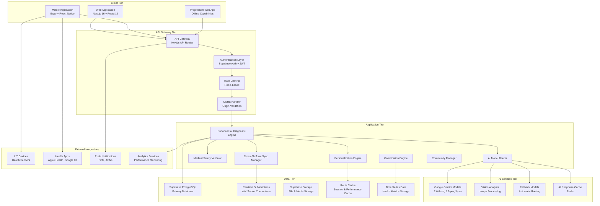
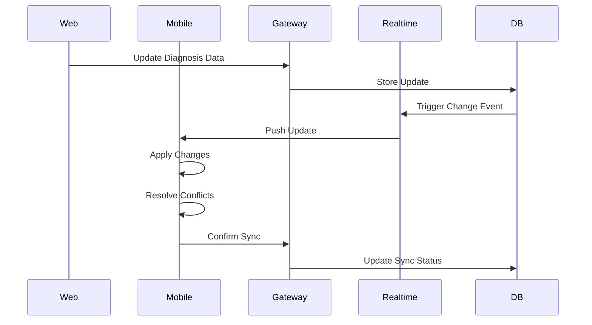
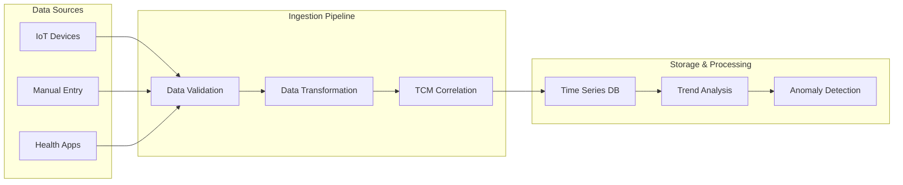
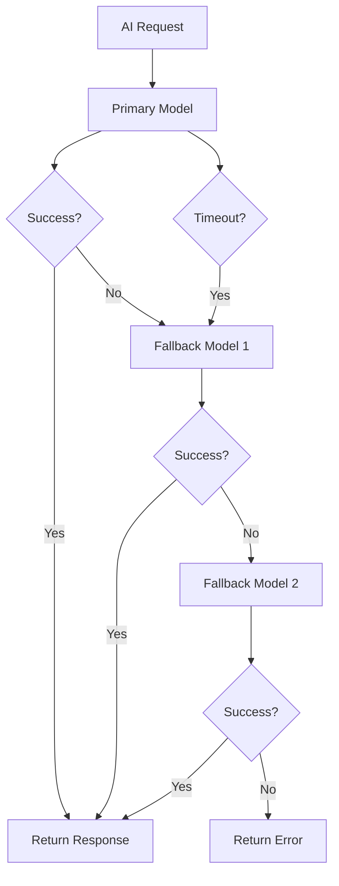
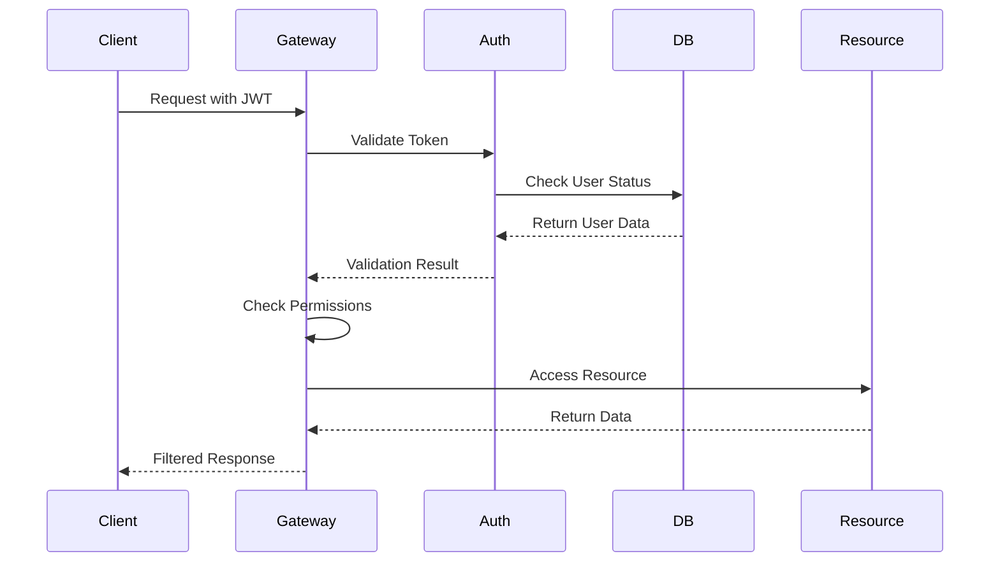
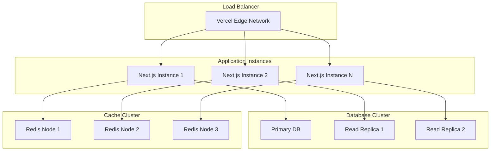
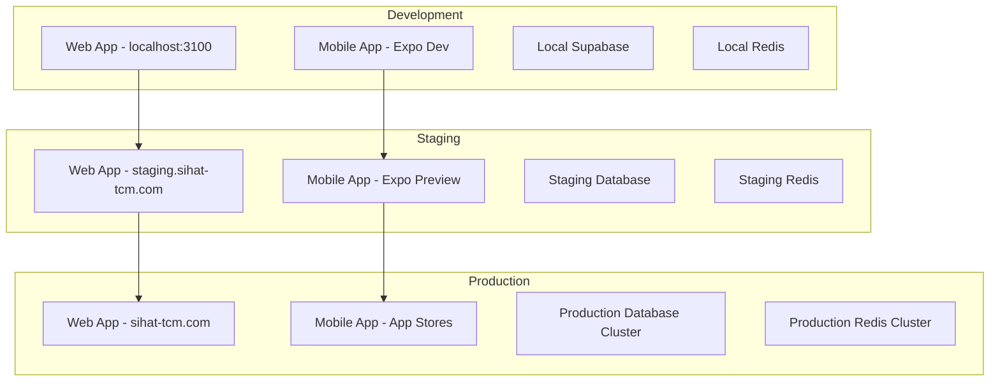

# Sihat TCM System Architecture Documentation

**Version**: 4.0 (Enhanced)  
**Last Updated**: December 2024  
**Target Audience**: System Architects, Senior Developers, DevOps Engineers

## Table of Contents

1. [Architecture Overview](#architecture-overview)
2. [System Components](#system-components)
3. [Data Flow Architecture](#data-flow-architecture)
4. [AI Processing Pipeline](#ai-processing-pipeline)
5. [Security Architecture](#security-architecture)
6. [Scalability and Performance](#scalability-and-performance)
7. [Integration Architecture](#integration-architecture)
8. [Deployment Architecture](#deployment-architecture)
9. [Monitoring and Observability](#monitoring-and-observability)
10. [Disaster Recovery](#disaster-recovery)

## Architecture Overview

### High-Level System Architecture



### Architectural Principles

#### 1. Microservices-Oriented Design

- **Modular Components**: Each major functionality is encapsulated in separate, loosely-coupled modules
- **Single Responsibility**: Each service has a clear, focused purpose
- **Independent Deployment**: Components can be updated independently
- **Fault Isolation**: Failures in one component don't cascade to others

#### 2. Event-Driven Architecture

- **Asynchronous Processing**: Non-blocking operations for better performance
- **Real-time Updates**: WebSocket-based real-time synchronization
- **Event Sourcing**: Track all changes for audit and recovery
- **Pub/Sub Patterns**: Decoupled communication between components

#### 3. API-First Design

- **RESTful APIs**: Consistent, predictable API design
- **GraphQL Support**: Flexible data querying for complex use cases
- **Versioning Strategy**: Backward-compatible API evolution
- **Documentation-Driven**: Comprehensive API documentation

#### 4. Security by Design

- **Zero Trust Model**: Verify every request and user
- **Defense in Depth**: Multiple layers of security controls
- **Principle of Least Privilege**: Minimal necessary permissions
- **Data Encryption**: End-to-end encryption for sensitive data

## System Components

### Frontend Layer

#### Web Application (Next.js 16)

```typescript
// Architecture: App Router with Server Components
app/
├── (auth)/                 # Authentication routes
├── (dashboard)/           # Main application routes
├── api/                   # API route handlers
├── globals.css           # Global styles
└── layout.tsx            # Root layout

// Key Features:
- Server-Side Rendering (SSR)
- Static Site Generation (SSG)
- Incremental Static Regeneration (ISR)
- Edge Runtime Support
- Built-in Image Optimization
```

**Technology Stack:**

- **Framework**: Next.js 16 with App Router
- **UI Library**: React 19.2.1 with Concurrent Features
- **Styling**: Tailwind CSS v4 with CSS-in-JS
- **Components**: Radix UI for accessibility
- **Animation**: Framer Motion for smooth interactions
- **State Management**: React Context + Zustand for complex state

#### Mobile Application (Expo/React Native)

```typescript
// Architecture: Expo Managed Workflow
src/
├── screens/              # Screen components
├── components/           # Reusable UI components
├── navigation/           # Navigation configuration
├── services/            # API and external services
├── store/               # State management
└── utils/               # Utility functions

// Key Features:
- Cross-platform iOS/Android support
- Over-the-air updates with Expo Updates
- Native module integration
- Push notifications
- Camera and sensor access
```

**Technology Stack:**

- **Framework**: Expo SDK 52 with React Native
- **Navigation**: React Navigation v6
- **State Management**: Redux Toolkit + RTK Query
- **UI Components**: React Native Elements
- **Animations**: React Native Reanimated 3
- **Storage**: AsyncStorage + SQLite

### Backend Layer

#### API Gateway (Next.js API Routes)

```typescript
// Route Structure
api/
├── v1/                   # Legacy API endpoints
├── v2/                   # Enhanced API endpoints
│   ├── enhanced-diagnosis/
│   ├── health-data/
│   ├── safety/
│   ├── personalization/
│   └── monitoring/
├── auth/                 # Authentication endpoints
└── webhooks/            # External service webhooks

// Middleware Pipeline
Request → CORS → Auth → Rate Limit → Validation → Handler → Response
```

**Key Features:**

- **Automatic API Routes**: File-based routing system
- **Middleware Support**: Request/response processing pipeline
- **Edge Runtime**: Global distribution for low latency
- **Built-in Optimization**: Automatic code splitting and caching
- **TypeScript Support**: End-to-end type safety

#### Enhanced AI Diagnostic Engine

```typescript
// Core Architecture
class EnhancedAIDiagnosticEngine {
  private modelRouter: AIModelRouter;
  private personalizationEngine: PersonalizationEngine;
  private safetyValidator: MedicalSafetyValidator;

  // Processing Pipeline
  async processEnhancedDiagnosis(request: DiagnosticRequest) {
    // 1. Analyze request complexity
    const complexity = this.analyzeComplexity(request);

    // 2. Select optimal AI model
    const model = this.modelRouter.selectModel(complexity);

    // 3. Generate base diagnosis
    const diagnosis = await this.generateDiagnosis(request, model);

    // 4. Apply personalization
    const personalized = await this.personalizationEngine.enhance(diagnosis);

    // 5. Validate safety
    const validated = await this.safetyValidator.validate(personalized);

    return validated;
  }
}
```

**Responsibilities:**

- **Request Orchestration**: Coordinate all AI processing steps
- **Model Selection**: Choose optimal AI model for each request
- **Quality Assurance**: Ensure response quality and safety
- **Performance Monitoring**: Track and optimize processing times
- **Error Handling**: Graceful degradation and fallback mechanisms

### Data Layer

#### Primary Database (Supabase PostgreSQL)

```sql
-- Database Architecture
-- Core Tables
users                    -- User accounts and profiles
patients                 -- Patient medical information
practitioners           -- Healthcare provider profiles
diagnosis_sessions      -- Diagnostic consultation sessions
medical_reports         -- Generated TCM reports
health_time_series     -- Time-series health data

-- Enhanced Tables
personalization_profiles -- User preference learning
safety_validations      -- Medical safety check results
ai_model_performance   -- AI model usage metrics
gamification_data      -- Qi Garden and achievements
community_interactions -- Social features data

-- Indexes and Optimization
CREATE INDEX CONCURRENTLY idx_diagnosis_patient_date
ON diagnosis_sessions(patient_id, created_at DESC);

CREATE INDEX CONCURRENTLY idx_health_data_timeseries
ON health_time_series(patient_id, data_type, timestamp DESC);
```

**Key Features:**

- **Row Level Security (RLS)**: Database-level access control
- **Real-time Subscriptions**: WebSocket-based live updates
- **Automatic Backups**: Point-in-time recovery
- **Connection Pooling**: Efficient database connection management
- **Full-text Search**: Advanced search capabilities

#### Caching Layer (Redis)

```typescript
// Cache Architecture
interface CacheStrategy {
  // AI Response Caching
  aiResponses: {
    ttl: 3600; // 1 hour
    keyPattern: "ai:response:{hash}";
  };

  // User Session Caching
  userSessions: {
    ttl: 86400; // 24 hours
    keyPattern: "session:{userId}";
  };

  // Personalization Data
  personalization: {
    ttl: 7200; // 2 hours
    keyPattern: "personal:{userId}";
  };

  // Rate Limiting
  rateLimits: {
    ttl: 3600; // 1 hour
    keyPattern: "rate:{ip}:{endpoint}";
  };
}
```

**Use Cases:**

- **Session Storage**: User authentication and session data
- **API Response Caching**: Reduce AI model API calls
- **Rate Limiting**: Track and enforce API usage limits
- **Personalization Cache**: Fast access to user preferences
- **Real-time Data**: Temporary storage for live features

## Data Flow Architecture

### Diagnostic Processing Flow

```mermaid
sequenceDiagram
    participant Client
    participant Gateway
    participant Engine
    participant Router
    participant AI
    participant Safety
    participant DB

    Client->>Gateway: POST /api/v2/enhanced-diagnosis
    Gateway->>Gateway: Authenticate & Validate
    Gateway->>Engine: Process Request

    Engine->>Engine: Analyze Complexity
    Engine->>Router: Select Optimal Model
    Router->>Router: Check Performance History
    Router-->>Engine: Return Model Selection

    Engine->>AI: Generate Diagnosis
    AI-->>Engine: Return AI Response

    Engine->>Safety: Validate Safety
    Safety->>Safety: Check Interactions
    Safety->>Safety: Validate Contraindications
    Safety-->>Engine: Return Safety Result

    Engine->>DB: Store Results
    DB-->>Engine: Confirm Storage

    Engine-->>Gateway: Return Enhanced Result
    Gateway-->>Client: JSON Response
```



### Real-time Synchronization Flow



### Health Data Ingestion Flow



## AI Processing Pipeline

### Model Selection Architecture

```typescript
// AI Model Router Decision Tree
class AIModelRouter {
  selectModel(criteria: ModelSelectionCriteria): ModelSelection {
    // 1. Analyze Request Complexity
    const complexity = this.analyzeComplexity(criteria);

    // 2. Check Performance History
    const performance = this.getModelPerformance();

    // 3. Apply Selection Logic
    if (complexity.score >= 75) {
      return this.selectAdvancedModel(performance);
    } else if (complexity.hasImages) {
      return this.selectVisionModel(performance);
    } else if (criteria.doctorLevel === "master") {
      return this.selectExpertModel(performance);
    } else {
      return this.selectStandardModel(performance);
    }
  }

  private selectAdvancedModel(performance: PerformanceData): ModelSelection {
    // Prefer Gemini 3-pro-preview for complex analysis
    const candidates = ["gemini-3-pro-preview", "gemini-2.5-pro"];
    return this.getBestPerforming(candidates, performance);
  }
}
```

### Fallback Mechanism



### Safety Validation Pipeline

```typescript
// Medical Safety Validation Architecture
class MedicalSafetyValidator {
  async validateRecommendations(
    recommendations: Recommendations,
    context: ValidationContext
  ): Promise<SafetyResult> {
    // Parallel Safety Checks
    const [
      allergyCheck,
      drugInteractionCheck,
      contraindictionCheck,
      emergencyCheck,
      pregnancyCheck,
      ageCheck,
    ] = await Promise.all([
      this.checkAllergies(recommendations, context),
      this.checkDrugInteractions(recommendations, context),
      this.checkContraindications(recommendations, context),
      this.detectEmergencyConditions(context),
      this.checkPregnancySafety(recommendations, context),
      this.checkAgeAppropriate(recommendations, context),
    ]);

    // Combine Results
    return this.combineValidationResults([
      allergyCheck,
      drugInteractionCheck,
      contraindictionCheck,
      emergencyCheck,
      pregnancyCheck,
      ageCheck,
    ]);
  }
}
```

## Security Architecture

### Authentication and Authorization Flow



### Data Protection Layers

#### 1. Transport Security

```typescript
// HTTPS Enforcement
export function enforceHTTPS(request: Request): Response | null {
  const protocol = request.headers.get("x-forwarded-proto");

  if (protocol !== "https" && process.env.NODE_ENV === "production") {
    const httpsUrl = request.url.replace("http://", "https://");
    return Response.redirect(httpsUrl, 301);
  }

  return null;
}
```

#### 2. Application Security

```typescript
// Input Validation and Sanitization
import { z } from "zod";
import DOMPurify from "dompurify";

const DiagnosisSchema = z.object({
  userId: z.string().uuid(),
  messages: z.array(
    z.object({
      content: z
        .string()
        .max(10000)
        .transform((content) => DOMPurify.sanitize(content)),
    })
  ),
});
```

#### 3. Database Security

```sql
-- Row Level Security Policies
CREATE POLICY "Users can only access their own data"
ON patients FOR ALL
USING (auth.uid() = id);

CREATE POLICY "Practitioners can access assigned patients"
ON diagnosis_sessions FOR SELECT
USING (
  practitioner_id = auth.uid() OR
  patient_id = auth.uid()
);
```

#### 4. API Security

```typescript
// Rate Limiting Implementation
import { Ratelimit } from "@upstash/ratelimit";

const ratelimit = new Ratelimit({
  redis: Redis.fromEnv(),
  limiter: Ratelimit.slidingWindow(100, "1 h"),
  analytics: true,
});

export async function checkRateLimit(identifier: string) {
  const { success, limit, reset, remaining } = await ratelimit.limit(identifier);

  if (!success) {
    throw new RateLimitError("Too many requests");
  }

  return { limit, reset, remaining };
}
```

### Privacy and Compliance

#### HIPAA Compliance Measures

- **Data Encryption**: AES-256 encryption at rest and in transit
- **Access Logging**: Comprehensive audit trails for all data access
- **Data Minimization**: Collect only necessary medical information
- **User Consent**: Explicit consent for data processing and sharing
- **Data Retention**: Automatic deletion of expired data

#### GDPR Compliance Features

- **Right to Access**: API endpoints for data export
- **Right to Rectification**: User-controlled data updates
- **Right to Erasure**: Complete data deletion capabilities
- **Data Portability**: Standardized data export formats
- **Privacy by Design**: Built-in privacy protections

## Scalability and Performance

### Horizontal Scaling Architecture



### Performance Optimization Strategies

#### 1. Caching Strategy

```typescript
// Multi-Level Caching
interface CachingStrategy {
  // Level 1: Browser Cache
  browserCache: {
    staticAssets: "1 year";
    apiResponses: "5 minutes";
    userPreferences: "1 hour";
  };

  // Level 2: CDN Cache (Vercel Edge)
  cdnCache: {
    staticContent: "1 year";
    dynamicContent: "1 minute";
    apiResponses: "30 seconds";
  };

  // Level 3: Application Cache (Redis)
  applicationCache: {
    aiResponses: "1 hour";
    userSessions: "24 hours";
    databaseQueries: "15 minutes";
  };

  // Level 4: Database Cache
  databaseCache: {
    queryPlans: "automatic";
    frequentQueries: "automatic";
    indexedData: "automatic";
  };
}
```

#### 2. Database Optimization

```sql
-- Query Optimization
-- Use covering indexes for frequent queries
CREATE INDEX CONCURRENTLY idx_diagnosis_sessions_covering
ON diagnosis_sessions(patient_id, status, created_at)
INCLUDE (id, overall_score, confidence);

-- Partition large tables by date
CREATE TABLE diagnosis_sessions_2024 PARTITION OF diagnosis_sessions
FOR VALUES FROM ('2024-01-01') TO ('2025-01-01');

-- Use materialized views for complex aggregations
CREATE MATERIALIZED VIEW patient_health_summary AS
SELECT
  patient_id,
  COUNT(*) as total_diagnoses,
  AVG(overall_score) as avg_score,
  MAX(created_at) as last_diagnosis
FROM diagnosis_sessions
WHERE status = 'completed'
GROUP BY patient_id;
```

#### 3. AI Model Optimization

```typescript
// Model Performance Optimization
class OptimizedModelRouter {
  // Cache frequently used model responses
  private responseCache = new Map<string, CachedResponse>();

  async generateWithCaching(request: AIRequest): Promise<AIResponse> {
    const cacheKey = this.generateCacheKey(request);

    // Check cache first
    const cached = this.responseCache.get(cacheKey);
    if (cached && !this.isCacheExpired(cached)) {
      return cached.response;
    }

    // Generate new response
    const response = await this.generateResponse(request);

    // Cache for future use
    this.responseCache.set(cacheKey, {
      response,
      timestamp: Date.now(),
      ttl: this.calculateTTL(request),
    });

    return response;
  }
}
```

### Auto-Scaling Configuration

```typescript
// Vercel Auto-Scaling Configuration
export const config = {
  // Edge Runtime for global distribution
  runtime: "edge",

  // Automatic scaling based on demand
  regions: ["iad1", "sfo1", "fra1", "sin1"],

  // Memory and timeout limits
  maxDuration: 30, // seconds
  memory: 1024, // MB
};

// Database Connection Pooling
const supabase = createClient(url, key, {
  db: {
    schema: "public",
  },
  auth: {
    autoRefreshToken: true,
    persistSession: true,
  },
  global: {
    headers: { "x-my-custom-header": "my-app-name" },
  },
  // Connection pooling configuration
  pooler: {
    mode: "transaction",
    maxConnections: 20,
    idleTimeout: 60000,
  },
});
```

## Integration Architecture

### External Service Integrations

#### IoT Device Integration

```typescript
// IoT Device Manager Architecture
class IoTDeviceManager {
  private deviceConnections = new Map<string, DeviceConnection>();

  async registerDevice(deviceInfo: DeviceInfo): Promise<DeviceRegistration> {
    // 1. Validate device credentials
    await this.validateDevice(deviceInfo);

    // 2. Establish secure connection
    const connection = await this.establishConnection(deviceInfo);

    // 3. Configure data sync
    await this.configureSyncSchedule(deviceInfo);

    // 4. Start health monitoring
    this.startHealthMonitoring(deviceInfo.deviceId);

    return {
      deviceId: deviceInfo.deviceId,
      status: "registered",
      syncSchedule: this.getSyncSchedule(deviceInfo),
    };
  }

  async syncHealthData(deviceId: string): Promise<SyncResult> {
    const connection = this.deviceConnections.get(deviceId);
    if (!connection) {
      throw new Error("Device not connected");
    }

    // Fetch latest data from device
    const rawData = await connection.fetchLatestData();

    // Transform to TCM-compatible format
    const transformedData = await this.transformHealthData(rawData);

    // Store in time-series database
    await this.storeHealthData(transformedData);

    // Trigger TCM analysis
    await this.triggerTCMAnalysis(transformedData);

    return {
      recordsProcessed: transformedData.length,
      lastSync: new Date().toISOString(),
    };
  }
}
```

#### Health App Integration

```typescript
// Health App Integration Manager
class HealthAppIntegrationManager {
  // Apple Health Integration
  async syncAppleHealth(userId: string): Promise<HealthData[]> {
    const healthKit = new AppleHealthKit();

    const permissions = {
      read: ["HeartRate", "BloodPressure", "Weight", "Height", "Steps", "SleepAnalysis"],
    };

    await healthKit.requestPermissions(permissions);

    const healthData = await Promise.all([
      healthKit.getHeartRateSamples(),
      healthKit.getBloodPressureSamples(),
      healthKit.getWeightSamples(),
      healthKit.getStepCountSamples(),
      healthKit.getSleepSamples(),
    ]);

    return this.normalizeHealthData(healthData);
  }

  // Google Fit Integration
  async syncGoogleFit(userId: string): Promise<HealthData[]> {
    const googleFit = new GoogleFitAPI();

    const dataTypes = [
      "com.google.heart_rate.bpm",
      "com.google.blood_pressure",
      "com.google.weight",
      "com.google.step_count.delta",
      "com.google.sleep.segment",
    ];

    const healthData = await googleFit.readData({
      dataTypes,
      timeRange: {
        startTime: Date.now() - 7 * 24 * 60 * 60 * 1000, // Last 7 days
        endTime: Date.now(),
      },
    });

    return this.normalizeHealthData(healthData);
  }
}
```

### API Integration Patterns

#### Circuit Breaker Pattern

```typescript
// Circuit Breaker for External API Calls
class CircuitBreaker {
  private state: "CLOSED" | "OPEN" | "HALF_OPEN" = "CLOSED";
  private failureCount = 0;
  private lastFailureTime = 0;

  async execute<T>(operation: () => Promise<T>): Promise<T> {
    if (this.state === "OPEN") {
      if (Date.now() - this.lastFailureTime > this.timeout) {
        this.state = "HALF_OPEN";
      } else {
        throw new Error("Circuit breaker is OPEN");
      }
    }

    try {
      const result = await operation();
      this.onSuccess();
      return result;
    } catch (error) {
      this.onFailure();
      throw error;
    }
  }

  private onSuccess(): void {
    this.failureCount = 0;
    this.state = "CLOSED";
  }

  private onFailure(): void {
    this.failureCount++;
    this.lastFailureTime = Date.now();

    if (this.failureCount >= this.threshold) {
      this.state = "OPEN";
    }
  }
}
```

## Deployment Architecture

### Multi-Environment Strategy



### CI/CD Pipeline

```yaml
# .github/workflows/ci-cd.yml
name: CI/CD Pipeline

on:
  push:
    branches: [main, develop]
  pull_request:
    branches: [main]

jobs:
  test:
    runs-on: ubuntu-latest
    steps:
      - uses: actions/checkout@v4
      - uses: actions/setup-node@v4
        with:
          node-version: "18"
          cache: "npm"

      - name: Install dependencies
        run: npm ci

      - name: Run type checking
        run: npm run type-check

      - name: Run linting
        run: npm run lint

      - name: Run unit tests
        run: npm run test:unit

      - name: Run integration tests
        run: npm run test:integration

      - name: Run property-based tests
        run: npm run test:properties

      - name: Check test coverage
        run: npm run test:coverage

  build:
    needs: test
    runs-on: ubuntu-latest
    steps:
      - uses: actions/checkout@v4
      - uses: actions/setup-node@v4
        with:
          node-version: "18"
          cache: "npm"

      - name: Install dependencies
        run: npm ci

      - name: Build application
        run: npm run build
        env:
          NEXT_PUBLIC_SUPABASE_URL: ${{ secrets.SUPABASE_URL }}
          NEXT_PUBLIC_SUPABASE_ANON_KEY: ${{ secrets.SUPABASE_ANON_KEY }}

      - name: Upload build artifacts
        uses: actions/upload-artifact@v4
        with:
          name: build-files
          path: .next/

  deploy-staging:
    needs: build
    runs-on: ubuntu-latest
    if: github.ref == 'refs/heads/develop'
    steps:
      - name: Deploy to Vercel Staging
        uses: amondnet/vercel-action@v25
        with:
          vercel-token: ${{ secrets.VERCEL_TOKEN }}
          vercel-org-id: ${{ secrets.VERCEL_ORG_ID }}
          vercel-project-id: ${{ secrets.VERCEL_PROJECT_ID }}
          scope: staging

  deploy-production:
    needs: build
    runs-on: ubuntu-latest
    if: github.ref == 'refs/heads/main'
    steps:
      - name: Deploy to Vercel Production
        uses: amondnet/vercel-action@v25
        with:
          vercel-token: ${{ secrets.VERCEL_TOKEN }}
          vercel-org-id: ${{ secrets.VERCEL_ORG_ID }}
          vercel-project-id: ${{ secrets.VERCEL_PROJECT_ID }}
          vercel-args: "--prod"
```

### Infrastructure as Code

```typescript
// Vercel Configuration
// vercel.json
{
  "version": 2,
  "builds": [
    {
      "src": "package.json",
      "use": "@vercel/next"
    }
  ],
  "routes": [
    {
      "src": "/api/(.*)",
      "dest": "/api/$1"
    },
    {
      "src": "/(.*)",
      "dest": "/$1"
    }
  ],
  "env": {
    "NEXT_PUBLIC_SUPABASE_URL": "@supabase-url",
    "NEXT_PUBLIC_SUPABASE_ANON_KEY": "@supabase-anon-key",
    "SUPABASE_SERVICE_ROLE_KEY": "@supabase-service-role-key",
    "GOOGLE_GENERATIVE_AI_API_KEY": "@google-ai-api-key"
  },
  "functions": {
    "app/api/v2/enhanced-diagnosis/route.ts": {
      "maxDuration": 30
    },
    "app/api/v2/safety/validate-recommendations/route.ts": {
      "maxDuration": 15
    }
  }
}
```

## Monitoring and Observability

### Application Performance Monitoring

```typescript
// Performance Monitoring Setup
import * as Sentry from "@sentry/nextjs";
import { Analytics } from "@vercel/analytics/react";

// Sentry Configuration
Sentry.init({
  dsn: process.env.NEXT_PUBLIC_SENTRY_DSN,
  environment: process.env.NODE_ENV,
  tracesSampleRate: 0.1,
  beforeSend(event) {
    // Filter sensitive data
    if (event.request?.data) {
      delete event.request.data.medicalHistory;
      delete event.request.data.personalInfo;
    }
    return event;
  },
  integrations: [
    new Sentry.BrowserTracing({
      tracingOrigins: ["localhost", "sihat-tcm.com"],
    }),
  ],
});

// Custom Performance Tracking
export class PerformanceMonitor {
  static trackDiagnosisPerformance(userId: string, duration: number) {
    Sentry.addBreadcrumb({
      message: "Diagnosis completed",
      level: "info",
      data: { userId, duration },
    });

    // Track custom metrics
    Sentry.setTag("operation", "diagnosis");
    Sentry.setMeasurement("diagnosis_duration", duration);
  }

  static trackAIModelPerformance(modelId: string, responseTime: number) {
    Sentry.addBreadcrumb({
      message: "AI model response",
      level: "info",
      data: { modelId, responseTime },
    });

    Sentry.setTag("ai_model", modelId);
    Sentry.setMeasurement("ai_response_time", responseTime);
  }
}
```

### Health Check System

```typescript
// Comprehensive Health Check
export async function systemHealthCheck(): Promise<HealthCheckResult> {
  const checks = await Promise.allSettled([
    checkDatabase(),
    checkAIServices(),
    checkExternalAPIs(),
    checkCacheLayer(),
    checkFileStorage(),
  ]);

  const results = checks.map((check, index) => {
    const services = ["database", "ai_services", "external_apis", "cache", "storage"];
    return {
      service: services[index],
      status: check.status === "fulfilled" ? "healthy" : "unhealthy",
      details: check.status === "fulfilled" ? check.value : check.reason,
      timestamp: new Date().toISOString(),
    };
  });

  const overallStatus = results.every((r) => r.status === "healthy")
    ? "healthy"
    : results.some((r) => r.status === "healthy")
      ? "degraded"
      : "unhealthy";

  return {
    status: overallStatus,
    checks: results,
    uptime: process.uptime(),
    version: process.env.npm_package_version,
  };
}

async function checkDatabase(): Promise<HealthCheckDetail> {
  const startTime = Date.now();

  try {
    const { data, error } = await supabase.from("users").select("count").limit(1);

    if (error) throw error;

    return {
      status: "healthy",
      responseTime: Date.now() - startTime,
      details: "Database connection successful",
    };
  } catch (error) {
    return {
      status: "unhealthy",
      responseTime: Date.now() - startTime,
      details: error.message,
    };
  }
}
```

### Logging and Analytics

```typescript
// Structured Logging System
import winston from "winston";

const logger = winston.createLogger({
  level: process.env.LOG_LEVEL || "info",
  format: winston.format.combine(
    winston.format.timestamp(),
    winston.format.errors({ stack: true }),
    winston.format.json()
  ),
  defaultMeta: {
    service: "sihat-tcm",
    version: process.env.npm_package_version,
  },
  transports: [
    new winston.transports.Console({
      format: winston.format.combine(winston.format.colorize(), winston.format.simple()),
    }),
    new winston.transports.File({
      filename: "logs/error.log",
      level: "error",
    }),
    new winston.transports.File({
      filename: "logs/combined.log",
    }),
  ],
});

// Custom Analytics Tracking
export class AnalyticsTracker {
  static trackUserJourney(userId: string, event: string, properties: any) {
    logger.info("User journey event", {
      userId,
      event,
      properties,
      timestamp: new Date().toISOString(),
    });

    // Send to analytics service
    if (typeof window !== "undefined") {
      // Client-side analytics
      gtag("event", event, {
        user_id: userId,
        ...properties,
      });
    }
  }

  static trackSystemPerformance(metric: string, value: number, tags: any = {}) {
    logger.info("System performance metric", {
      metric,
      value,
      tags,
      timestamp: new Date().toISOString(),
    });
  }
}
```

## Disaster Recovery

### Backup Strategy

#### Database Backups

```sql
-- Automated Backup Configuration
-- Supabase provides automatic backups, but we also implement custom backups

-- Daily full backup
SELECT pg_dump('sihat_tcm_production')
TO 's3://sihat-tcm-backups/daily/' || current_date || '.sql';

-- Hourly incremental backup for critical tables
CREATE OR REPLACE FUNCTION backup_critical_tables()
RETURNS void AS $$
BEGIN
  -- Backup diagnosis sessions
  COPY (
    SELECT * FROM diagnosis_sessions
    WHERE updated_at > NOW() - INTERVAL '1 hour'
  ) TO 's3://sihat-tcm-backups/incremental/diagnosis_sessions_' ||
       extract(epoch from now()) || '.csv'
  WITH CSV HEADER;

  -- Backup medical reports
  COPY (
    SELECT * FROM medical_reports
    WHERE updated_at > NOW() - INTERVAL '1 hour'
  ) TO 's3://sihat-tcm-backups/incremental/medical_reports_' ||
       extract(epoch from now()) || '.csv'
  WITH CSV HEADER;
END;
$$ LANGUAGE plpgsql;

-- Schedule hourly backup
SELECT cron.schedule('backup-critical', '0 * * * *', 'SELECT backup_critical_tables();');
```

#### Application State Backup

```typescript
// Application State Backup System
export class BackupManager {
  async createSystemSnapshot(): Promise<SystemSnapshot> {
    const snapshot = {
      timestamp: new Date().toISOString(),
      version: process.env.npm_package_version,
      configuration: await this.backupConfiguration(),
      userSessions: await this.backupActiveSessions(),
      cacheState: await this.backupCacheState(),
      aiModelState: await this.backupAIModelState(),
    };

    // Store snapshot in multiple locations
    await Promise.all([
      this.storeToS3(snapshot),
      this.storeToVercelBlob(snapshot),
      this.storeToSupabaseStorage(snapshot),
    ]);

    return snapshot;
  }

  async restoreFromSnapshot(snapshotId: string): Promise<RestoreResult> {
    const snapshot = await this.retrieveSnapshot(snapshotId);

    const results = await Promise.allSettled([
      this.restoreConfiguration(snapshot.configuration),
      this.restoreUserSessions(snapshot.userSessions),
      this.restoreCacheState(snapshot.cacheState),
      this.restoreAIModelState(snapshot.aiModelState),
    ]);

    return {
      success: results.every((r) => r.status === "fulfilled"),
      details: results,
      restoredAt: new Date().toISOString(),
    };
  }
}
```

### Failover Mechanisms

#### Database Failover

```typescript
// Database Connection with Automatic Failover
class DatabaseManager {
  private connections: SupabaseClient[] = [];
  private currentConnectionIndex = 0;

  constructor() {
    // Primary database
    this.connections.push(
      createClient(process.env.SUPABASE_PRIMARY_URL!, process.env.SUPABASE_PRIMARY_KEY!)
    );

    // Read replicas
    this.connections.push(
      createClient(process.env.SUPABASE_REPLICA_1_URL!, process.env.SUPABASE_REPLICA_1_KEY!)
    );

    this.connections.push(
      createClient(process.env.SUPABASE_REPLICA_2_URL!, process.env.SUPABASE_REPLICA_2_KEY!)
    );
  }

  async executeQuery<T>(query: () => Promise<T>): Promise<T> {
    let lastError: Error | null = null;

    // Try each connection in order
    for (let i = 0; i < this.connections.length; i++) {
      const connectionIndex = (this.currentConnectionIndex + i) % this.connections.length;

      try {
        const result = await query();

        // Update current connection on success
        this.currentConnectionIndex = connectionIndex;
        return result;
      } catch (error) {
        lastError = error as Error;
        logger.warn(`Database connection ${connectionIndex} failed`, { error });

        // Mark connection as unhealthy
        this.markConnectionUnhealthy(connectionIndex);
      }
    }

    throw new Error(`All database connections failed. Last error: ${lastError?.message}`);
  }
}
```

#### AI Service Failover

```typescript
// AI Service Failover with Circuit Breaker
class AIServiceManager {
  private services: AIService[] = [
    new GeminiService("primary"),
    new GeminiService("fallback-1"),
    new OpenAIService("fallback-2"),
  ];

  private circuitBreakers = new Map<string, CircuitBreaker>();

  async generateResponse(request: AIRequest): Promise<AIResponse> {
    for (const service of this.services) {
      const circuitBreaker = this.getCircuitBreaker(service.id);

      try {
        const response = await circuitBreaker.execute(() => service.generateResponse(request));

        logger.info(`AI response generated successfully`, {
          serviceId: service.id,
          responseTime: response.metadata.responseTime,
        });

        return response;
      } catch (error) {
        logger.warn(`AI service ${service.id} failed`, { error });
        continue;
      }
    }

    throw new Error("All AI services are unavailable");
  }

  private getCircuitBreaker(serviceId: string): CircuitBreaker {
    if (!this.circuitBreakers.has(serviceId)) {
      this.circuitBreakers.set(
        serviceId,
        new CircuitBreaker({
          threshold: 5,
          timeout: 60000,
          resetTimeout: 30000,
        })
      );
    }

    return this.circuitBreakers.get(serviceId)!;
  }
}
```

### Recovery Procedures

#### Automated Recovery

```typescript
// Automated System Recovery
export class RecoveryManager {
  async performAutomatedRecovery(): Promise<RecoveryResult> {
    const healthCheck = await systemHealthCheck();

    if (healthCheck.status === "healthy") {
      return { success: true, message: "System is healthy" };
    }

    const recoveryActions = [];

    // Database recovery
    if (healthCheck.checks.database?.status === "unhealthy") {
      recoveryActions.push(this.recoverDatabase());
    }

    // Cache recovery
    if (healthCheck.checks.cache?.status === "unhealthy") {
      recoveryActions.push(this.recoverCache());
    }

    // AI service recovery
    if (healthCheck.checks.ai_services?.status === "unhealthy") {
      recoveryActions.push(this.recoverAIServices());
    }

    const results = await Promise.allSettled(recoveryActions);

    return {
      success: results.every((r) => r.status === "fulfilled"),
      actions: results.length,
      details: results,
    };
  }

  private async recoverDatabase(): Promise<void> {
    // Attempt to reconnect to database
    await this.databaseManager.reconnect();

    // Verify connection with simple query
    await this.databaseManager.executeQuery(() => supabase.from("users").select("count").limit(1));
  }

  private async recoverCache(): Promise<void> {
    // Clear corrupted cache entries
    await redis.flushall();

    // Warm up critical cache entries
    await this.warmUpCache();
  }

  private async recoverAIServices(): Promise<void> {
    // Reset circuit breakers
    this.aiServiceManager.resetCircuitBreakers();

    // Test AI service connectivity
    await this.aiServiceManager.testConnectivity();
  }
}
```

---

**This architecture documentation provides a comprehensive overview of the Sihat TCM system design. It should be reviewed and updated regularly as the system evolves.**
